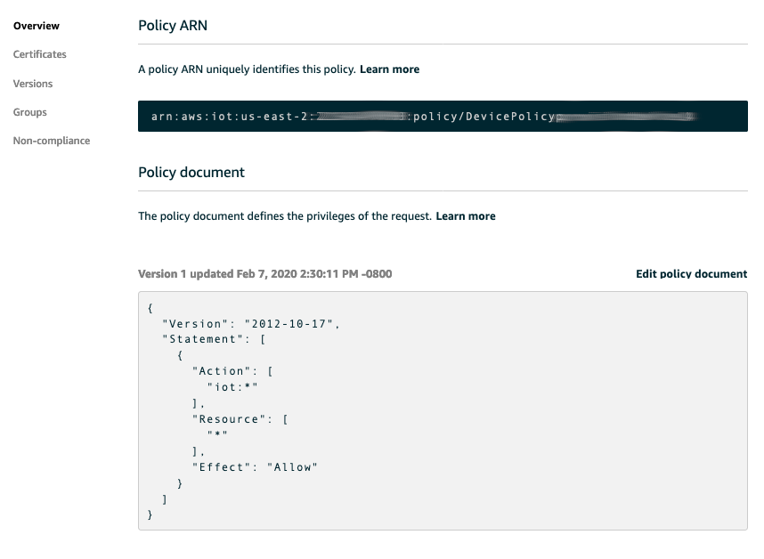
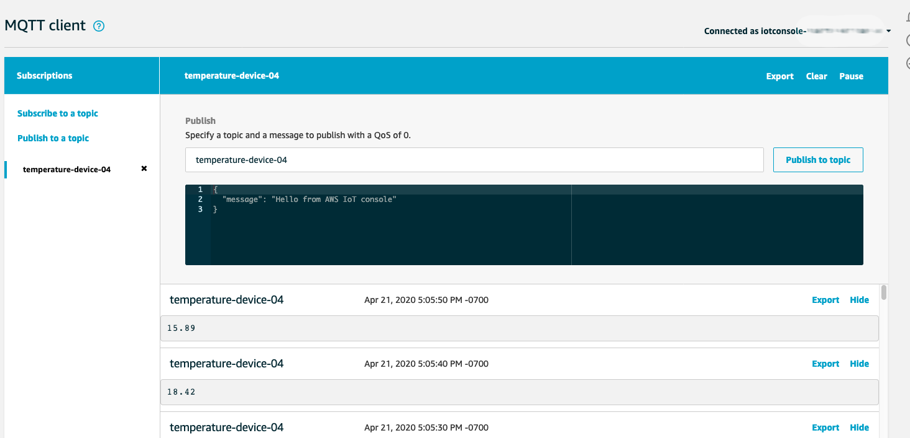

# Lab 1 - Provision Infrastructure

## What will be provided:
In this lab, AWS resources are already created for you in advance:

- 2 IoT Devices registered with AWS IoT
- 1 X.509 Certificate and it's private key
- 1 Audit scheduled daily

## Architecture Diagram:

## AWS resources walk-through

### 1. IoT devices

In this workshop, we will use 2 Lambda functions acting as 2 seperate IoT Devices: Device01 and Device02, respectively. Each device will send temperature telemetry to AWS IoT every 10 seconds. Let's look at the code of Lambda functions (writen in Python) by going to Lambda management console, and click on function Device01 or Device02:

First, the function will retrieve [AWS IoT Endpoint](https://docs.aws.amazon.com/iot/latest/developerguide/iot-custom-endpoints.html) so that it know which endpoint to send telemetry data to. To connect with AWS IoT Endpoint, IoT device needs to have  device certificate, private key, and root CA certificate installed. The next step is to have Lambda function checks if these files are already available in /tmp. If not, it will retrieve these files from AWS Secrets Manager. Finally, it generates random temperature telemetry data and sends it to AWS IoT Endpoint

### 2. AWS IoT Things

Two IoT Devices above are already registered to AWS IoT. Let's look at how we use AWS IoT to manage these devices. From the IoT Management Console, click on Manage, click on Things:

Click on SensorDevice01 to view more information about this Thing. Now let's look at how this Thing is authenticated to communicate with AWS IoT. On the left column, click on Security:

You will see a X.509 certificate is associated with this thing. When the device initiates connection to AWS IoT, it needs to present to AWS IoT this certificate, and the associated private key, as well as AWS IoT RootCA certificate as it's credentials. This certificate is currently valid and activated.

Now let's click on the certificate to get more details. You can see the ARN (Amazon Resource Name) of the certificate, as well as Create Date, Effective Date (when the cert is activated), and Expiration Date.

On the left side, click on Policies to examine what type of permission the IoT Thing that has this cert can perform. You will see a Policy named DevicePolicy* attached to this cert. This is [AWS IoT policies](https://docs.aws.amazon.com/iot/latest/developerguide/iot-policies.html) that allow you to control access to the AWS IoT data plane. They follow the same conventions as IAM policies. Click on this Policy and you will see the policy document specifies priviledges of the request that your IoT Devices send to AWS IoT.

What do you think about this policy? What would you do to only give appropriate permisison for the Thing associated to this certificate? To get some idea, you can look at [example AWS IoT policies here](https://docs.aws.amazon.com/iot/latest/developerguide/example-iot-policies.html)

### 3. Check if your devices are sending data to AWS IoT
Devices publish messages on topics to which AWS IoT or your applications can respond. You can use the AWS IoT MQTT client to subscribe to these topics to see the content of these messages or publish messages on these topics to update device state. From IoT management console, click on "Test", "Subscribe to a topic", then type in the topic name that your IoT Devices send telemetry data to, and click "Subscribe to topic". In this workshop, the topic names will be "temperature-device-01" and "temperature-device-02"

Seeing the temperature records? Yay! Your devices are connected and sending data to AWS IoT. That's exciting. Let's move to Lab 2 to find out how you can audit your devices configuration. 
