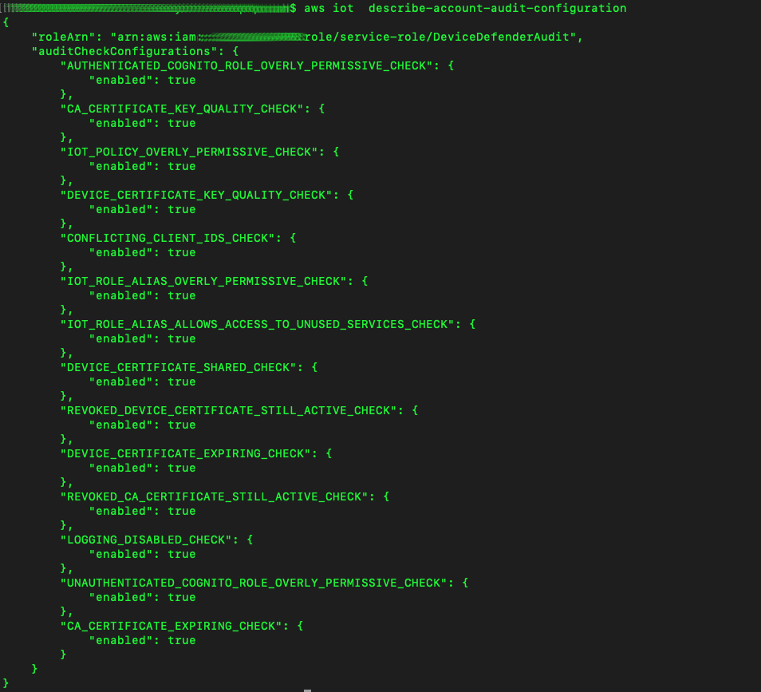
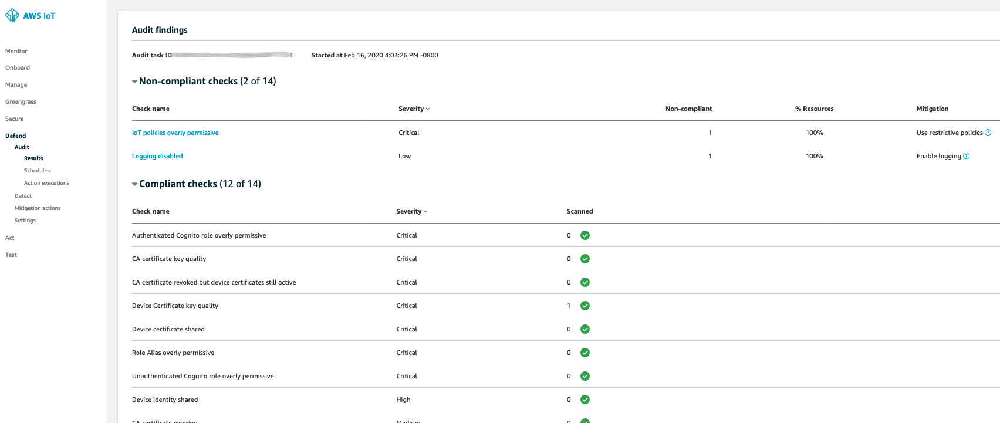

Before deploying IoT Devices into Production, you need to make sure approriate device-related settings and policies are applied correctly. You also need to have on-going checks to detect any drifts from security best practices after your IoT Devices are deployed into Production. 

You have identify multiple bad device configurations. You would like to Audit device configurations for security vulnerabilities and get notified if any of the devices don't pass all the checks. In this Lab, we will walk through steps to identify device's bad configuration, as well as to create mitigation actions using AWS IoT Device Defender

In this Lab, your task is to set up Audit using AWS IoT Device Defender to identify 3 checks
TODO: need to write a use case here
- need to detect if devices sharing a certificate 
- need to give appropriate permission following least priviledge model
- need to know if IoT logging is disable (AWS IoT logs in CloudWatch provide visibility into behaviors in AWS IoT, including authentication failures and unexpected connects and disconnects that might indicate that a device has been compromised. )

## 1. Audit your IoT Fleet

### 1.1 Check audit settings

To get start, you need to identify what type of check you would like to run against your devices. Conveniently, AWS IoT Device Defender has built in audit checks that you can quickly enable. Let's create an audit with these checks.

First, you need to configure  Device Defender audit settings in your AWS accout. Settings include how audit notifications are sent and which audit checks are enabled or disabled.  To check current audit settings, run describe-account-audit-configuration command from your terminal:

```
$ aws iot  describe-account-audit-configuration
```

The return output is a json object showing you list of available audit checks, and if these checks are enabled or disabled. 



To run any type of audit check, you will need it to be enabled. To enable or disable an audit check, run update-account-audit-configuration command in your terminal:

```
$aws iot update-account-audit-configuration \
    --audit-check-configurations "{\"AUTHENTICATED_COGNITO_ROLE_OVERLY_PERMISSIVE_CHECK\":{\"enabled\":true}}"
```
After all audit checks are already enabled, we can create an on-demand audit.


> Note: we already created an on-demand audit in advance for you because we would like to show you example results. In this Lab, you will not go through neccessary steps to give permisison to Device Defender to collect data, and to choose SNS topic to send notification. Outside of this Lab, you should follow [instruction in this document](https://docs.aws.amazon.com/iot/latest/developerguide/device-defender-HowToProceed.html) when you run Audit the very first time. 

### 1.2 Run an On-Demand Audit

From the IoT management console, click on **Defend**, **Audit**, **Schedules**. You will then see the current list of scheduled Audits. Click **Create** button on the top right to create a new Audit. From the **Available checks** list, you can enable or disble the checks that you would like to run agains your devices. Click on the question mark next to each check to understand what it will do. In this lab, let's keep all the checks enabled.


You have options to run Audit daily, weekly, bi-weekly, or monthly. With these options, IoT Device Defender will choose a time to start the audit for you. In this lab, let's choose **Run audit now(once)**. Then click **Create** to start the audit immediately


When you enable a check, data collection starts immediately. If there is a large amount of data in your account to collect, results of the check might not be available for some time after you enabled it.

To see audit results, click on **Defend**, **Audit**, **Results** 



Under **Non-compliant checks**, you can see which checks has failed, and why. To view resources associated to these findings, click on the check name.


Now we have a list of non-compliant checks, let's create automation to mitigate these failed checks

## 2. Take actions to mitigate audit findings

### 2.1 Define mitigation actions


### 2.2 Apply mitigation actions to audit findings

