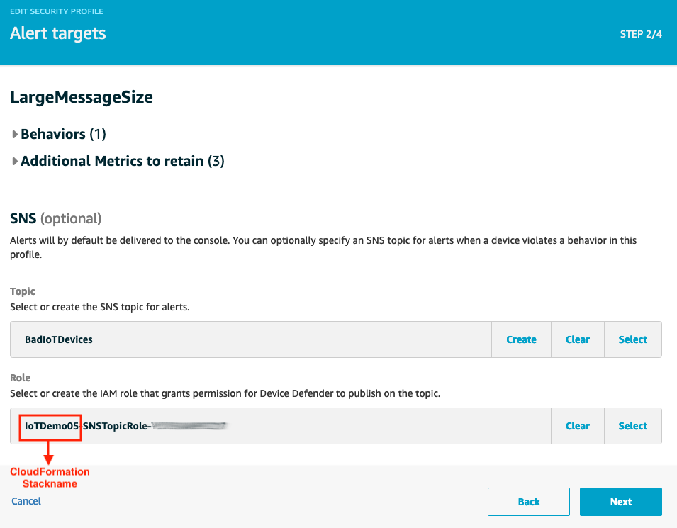

After you have identify potential external threats to your IoT devices, it's crucial to implement a solution to quickly detec if the devices are compromised, and take action to stop the attack. In this lab, your task is to detect if the device participate in a DDoS attack and becomes the source of the actack.

To do so, you will need to define when the devices' behaviors will be considered abnormal and need a human attention to check if it's actually compromised. So let's use AWS IoT Device Defender Detect for that.

## 1. Define unusual behaviors of your devices

You realizes that you can use 2 device metrics to detect if the devices are acting strangely: how much data the device is sending, and the freqency of sending. Now you can tell Device Defender to monitor these two metrics, and alert you if it's out of the threadhold that you define. A combination of anomalous behaviors and actions to take when abnomoly behavior is detected is called **Security Profile**

From the IoT management console, click **Defend**,**Detect**, **Security Profiles**, **Create your first security profile**. Name this security profile as **UnusualMessageVolume** and define 2 behaviors.


The first behavior is **messageSize**. We ask Device Defender to observe **Bytes out** metric and alert us if the size of the message going out of the device is greater than 5000 bytes - which is very much larger than the regular message size that Device01 and Device02 usually send to AWS IoT. We ask Device Defender to aggregate metric every 5 minutes as one datapoint. And if a device is in violation of this behavior for two datapoints, then the alarm will be trigger.

The second behavior is **numConnection**. We want Device Defender to observe number of **Connection attempts**. If our devices try to connect to AWS IoT endpoint for more than 35 times in 5 minutes, then Device Defender should create a datapoint. And alarm will be trigger after two or more datapoints.

We also need to keep relevant metrics for investigation. Under **Addionional Metrics to retain**, click on **Select** on the right corner to see drop down list of metrics that we can retain. In this lab, we'll choose **Established TCP connections count**, **Message size**, and **Message received**. Then click **Next**


Optional: you can specify a SNS topic for alerts when Device Defender alarm a violation



Now you need to attach this security profile to a target. A target can be a thing, or a thing group. For simplicity, we will attach this security profile with **All things** for now.


Click **Next** to view summary of this Security Profile. When you confirm everything is correct, then click **Save**

## 2. Simulate a compromised device 

In this step, we will update Device02 to similate a situation that it is compromised, and it is sending way too much data and way too often as it should be. 

### 2.1 Update message size

To update the amount of data Device02 is sending to AWS IoT, go to Lambda management console, click on function **Device02**. Scroll down to edit the code that generate random temperature telemetry data (line 55):

```
	deviceTemperature = round(random.uniform(15.1,29.9),2)
```
This telemetry data is usually 150bytes. Let's replace the line of code above with a very long big text to purposely increase it's size

```
  deviceTemperature = "AWS IoT Device Defender is a security service that allows you to audit the configuration of your devices, monitor connected devices to detect abnormal behavior, and mitigate security risks. It gives you the ability to enforce consistent security policies across your AWS IoT device fleet and respond quickly when devices are compromised. IoT fleets can consist of large numbers of devices that have diverse capabilities, are long-lived, and are geographically distributed. These characteristics make fleet setup complex and error-prone. And because devices are often constrained in computational power, memory, and storage capabilities, this limits the use of encryption and other forms of security on the devices themselves. Also, devices often use software with known vulnerabilities. These factors make IoT fleets an attractive target for hackers and make it difficult to secure your device fleet on an ongoing basis.AWS IoT Device Defender addresses these challenges by providing tools to identify security issues and deviations from best practices. AWS IoT Device Defender can audit device fleets to ensure they adhere to security best practices and detect abnormal behavior on devices. "
```

Click on **Save** on the top right corner to save this change. After that when this Lambda function run, it will send bigger message to AWS IoT

### 2.2 Update connection frequency

In this Lab, we use Step function to trigger Lambda function Device02 to establish connection and send data to AWS IoT every 10 seconds. To edit the frequency, let's change the **Definition** of Stage machines **LambdaSubMinute**


It will take time for Device Defender to collect datapoints. It also depends in the number of IoT devices and the Duration that you specify in the Security Profile. In this Lab, we expect you will see a violation under **Detect**, **Violations** within 15 minutes after you have update lambda function Device02

## 2. Respond to the violations
