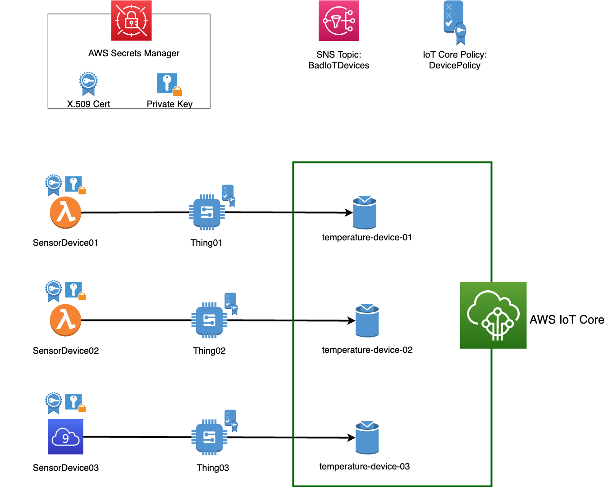
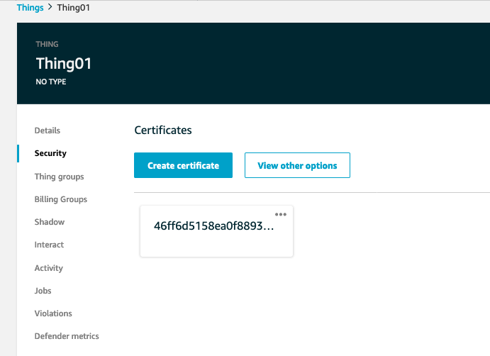
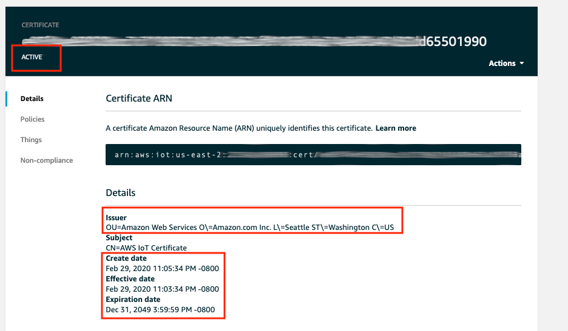

# Module 1: Environment build

This module walks your through IoT environment setup for this workshop. You will need an AWS account. Depending on the scenerios below, expand one of the following dropdowns to start.

**

Click here if you are at an AWS event where the Event Engine is being used
 **
  
   1. If you are at an AWS Sponsored event, you will be provided with either an AWS account or a hash key for Event Engine. Environment setup has been completed for you. You don't need to perform any provisioning in this module. To get start, go to [Available resources](#available-resources) to check what are already provisioned.

**

Click here if you are using your own AWS account (whether you are at an AWS event, a separate event or online)
 **
  
You will need to set up environment for this lab following these steps:
  
  1. **Choose a region:** sign in to your AWS Account. From AWS console home, choose a region that works best for you from the top right corner of the console. For example, Ohio or Oregon if you're in North America. 
  2. **Create a S3 bucket:** You will use CloudFormation to provision neccesary resources, including multiple Lambda functions. We need to use a S3 bucket to store deployment packages of these Lambda functions. If you don't have a S3 bucket, create a new one. Or you can using an existing non-prod bucket.
  3. Download CloudFormation template [setupinfra.yml](setupinfra.yml) and save it locally on your laptop/computer.
  4. Download these Lambda deployment packages and upload it to your S3 bucket. **Note:** these deployment packages need to be at the top level, and not in any folder of the S3 bucket
      
      a. [registerDevice.zip](registerDevice/registerDevice.zip)--> this deployment package is for a Lambda function that creates X.509 certificate, its private key and store it in AWS Secrets Manager. This function also creates an IoT Core policy and attachs it to X.509 certificate.
      
      b. [staraudit.zip](startaudit/startaudit.zip)--> this deployment package is for a Lambda function that start an on-demand Device Defender Audit
      
      c. [device.zip](device/device.zip)--> this deployment package is for a Lambda function acts as IoT Device. CloudFormation template will create 2 Lambda functions acting as 2 IoT devices.
      
  5. Create a new CloudFormation stack to provision AWS resources:
  
      a. From CloudFormation console, click **Create stacks, With new resources (standard)**
      
      b. Choose **Upload a new template**, and upload the CloudFormation template that you download to your laptop/computer earlier in step 3. Click **Next**
      
      c. Name this new CloudFormation stack. Under Parameter session, provide the **name of the S3 bucket** that you create in step 2. We recommend you to keep the default values of **IoT Parameters** for easy reference when you go through this workshop. You can provide values for these parameters if you are comfortable working with AWS IoT Thing and Topics.  
      
        

      d. Leave everything by default in **Configure stack options**. Click **Next** to go to review step
      
      e. In **Review**, scroll down to **The following resource(s) require capabilities: [AWS::IAM::ManagedPolicy]**. Check the box next to **I acknowledge that AWS CloudFormation might create IAM resources.**. Click **Create stack**. The stack  will take 5-10 minutes to complete. When the stack completes, move to [Available resources](#1-available-resources)
      

1. [Available resources](#1-available-resources)
2. [Validate environment setup](#2-validate-environment-setup)
3. [Check if your devices are sending data to AWS IoT](#3-check-if-your-devices-are-sending-data-to-aws-iot)

## 1. Available resources:

If you are at an AWS Event, you should be provided an AWS Account with the resources below ready to use. Otherwise, you will need to use your AWS Account and provision resources by following ["Click here if you are using your own AWS account (whether you are at an AWS event, a separate event or online)"](/Module%201:%20Environment%20build/README.md) at the beginning of this module

Here is the list of resources:

- 3 IoT Devices:  Device **SensorDevice01** and **SensorDevice02** are powered by Lambda functions. Device **SensorDevice03** is a Cloud9 environment (so that you can access this device and install Device Defender agent later in this workshop)
- 3 AWS IoT Things named **Thing01**, **Thing02**, **Thing03**
- 3 AWS IoT Topic **temperature-device-01**, **temperature-device-02**, **temperature-device-03**
- 1 X.509 Certificate and it's private key stored in AWS Secrets Manager
- 1 AWS IoT Core Policy named as **DevicePolicy-[CloudFormationStackname]**
- 1 on-demand Audit
- 1 SNS topic named as **BadIoTDevices-[CloudFormation stackname]**.  You will use this SNS topic to receive security realated alerts from AWS IoT Device Defender. 

**IMPORTANT: You need to subscribe your email to this SNS topic to receive notifications. If this is the first time you subscribe to a SNS topic, follow this [tutorial](https://docs.aws.amazon.com/sns/latest/dg/sns-tutorial-create-subscribe-endpoint-to-topic.html#create-subscribe-endpoint-to-topic-aws-console). After subscribe your email address, remember to CONFIRM YOUR SUBSCRIPTION**

Here is the architecture diagram for the environment setup:

Let's move to the next step, where you can validate if the environment setup is correct

## 2. Validate environment setup

### 1. Check IoT Devices powered by Lambda functions

In this workshop, we will use 2 Lambda functions acting as 2 seperate IoT Devices: SensorDevice01 and SensorDevice02.  Each device will send temperature telemetry to AWS IoT every 10 seconds. 

To understand how the devices send data, let's look at the code of Lambda functions (writen in Python):

1. From the AWS console home, click **Lambda**
2. Once you're in Lambda management console, click **Functions** on the left side. Then click on **SensorDevice01** (you can search for 'SensorDevice' name if you have too many funtions.

3. Scroll down to **Function code** and you will see  the Python code of this Lambda function. Here is a quick walk through what it does:

    a. First, the function will retrieve [AWS IoT Endpoint](https://docs.aws.amazon.com/iot/latest/developerguide/iot-custom-endpoints.html) to send telemetry data to. 
    
                  endpoint = iot.describe_endpoint(endpointType='iot:Data-ATS')
                  endpointaddress = endpoint['endpointAddress']
    
    b. Next, it checks if there is  a X.509 device certificate, private key, and [root CA certificate](https://docs.aws.amazon.com/iot/latest/developerguide/server-authentication.html#server-authentication-certs)(for server authentication) available in /tmp ([local storage directory for Lambda function](https://docs.aws.amazon.com/lambda/latest/dg/best-practices.html#function-code)). If not, it will retrieve these files from AWS Secrets Manager. IoT device needs these files to connect to AWS IoT.
    
            if os.path.isfile('/tmp/cert.pem'):
               print('/tmp/cert.pem is available')
            else:
               certpem = secretmanager.get_secret_value(SecretId='CertPem'+stackname)
               newcert = open('/tmp/cert.pem', 'w+')
               newcert.write(certpem['SecretString'])
               newcert.close()
                  ....more code 
            //download Amazon RootCA1 certificate
            if os.path.isfile('/tmp/rootca.pem'):
               print('/tmp/rootca.pem is available')
            else:
               url = 'https://www.amazontrust.com/repository/AmazonRootCA1.pem'
               newrootcapem = requests.get(url)
               open('/tmp/rootca.pem', 'wb').write(newrootcapem.content)
                      
    c. Next, it connects with AWS IoT using AWS IoT Python SDK 
    
            myMQTTClient = AWSIoTMQTTClient(devicename)
            myMQTTClient.configureEndpoint(endpointaddress, 8883)
            myMQTTClient.configureCredentials("/tmp/rootca.pem", "/tmp/private.key", "/tmp/cert.pem")
                    
    d. Finally, It generates random temperature telemetry data and sends it to AWS IoT Endpoint

            telemetrydata = round(random.uniform(15.1,29.9),2)
            #Connect to AWS IoT
            myMQTTClient.connect()
            myMQTTClient.publish(topicname, telemetrydata, 0)
            myMQTTClient.disconnect()

### 2. Check IoT Device powered by Cloud9 environment

The third IoT device **SensorDevice03** will be powered by a Cloud9 environment (so that you can log into this device later to instance Device Defender agent). To check if this Cloud9 environment is accessible, following these steps:

1. From AWS Console home, click or search for **Cloud9**
2. Click on **Your environments** on the left side to view the list of environments.  Select **SensorDevice03**, and click **Open IDE**. Wait for a few minutes for the environment to be accesible. 
3. You need to check if this Cloud9 environment has source code of AWS Device Defender Agent - so that you can install this agent later in this workshop. From the terminal, run these linux command:
        
        cd ~/environment/workshop
        ls -l
    You should see the source code **AWSIoTDeviceDefenderAgentSDK** 
     

### 3. AWS IoT Things

Three AWS IoT Things **Thing01, Thing02, Thing03** are already created for you. These Things are associated with a X.509 certificate (you'll learn more why using one certificate for multiple devices isn't a best practices in [Module 2: Audit your IoT Fleet](/Module%202:%20Audit%20your%20IoT%20Fleet). When devices **SensorDevice01,SensorDevice02, SensorDevice03** connect to AWS IoT, it needs to present this X.509 certificate and it's private key to prove that it is the Things registered with AWS IoT. You'll need to validate **Thing01, Thing02, Thing03** configuration to understand how AWS IoT associate these Thing with devices.

1. From AWS console home, click **IoT Core** to go to IoT management console.
2. Click **Manage, Things** to view the list of IoT Things
3. To get more information about a Thing, click on the Thing name (for example, **Thing01**). 
4. Each Thing need to use a X.509 certificate to authenticate with AWS IoT. To validate which certificate is associated to this **Thing01**, go to **Security**. You should see a X.509 already associates with this Thing.

5. This X.509 certificate need to be valid and activated. To check, click the certificate to get more information. You should see this certificate is issued by Amazon Web Services. It is currently **Active** with an Expiration date

6. Remember that X.509 certificate is for Authentication. Now you need to validate device's Authorization - what actions this device is allowed to perform. AWS IoT use IoT Core Policy and IAM Policy. In this workshop, we will use IoT Core Policy to grant permission to devices. To understand how AWS use IAM Policy, take a look at [this IAM policies document](https://docs.aws.amazon.com/iot/latest/developerguide/iam-policies.html)

7. AWS IoT Core policies determine which operations are allowed. Operations are divided into two groups: data plan and control plan. 
    - Control plane API allows you to perform administrative tasks like creating or updating certificates, things, rules, and so on.
    - Data plane API allows you send data to and receive data from AWS IoT Core.
   If you would like to dive deeper into AWS IoT Core policies, follow [this AWS IoT Core Policies document](https://docs.aws.amazon.com/iot/latest/developerguide/iot-policies.html) 

8. To check which actions that your AWS IoT Thing can perform, you need to check the IoT Core Policies (or Policies in short) that associate with this Thing. Each Thing can have multiple Policies. A Policy can be attached to a X.509 certificate, or an AWS IoT Thing Group. In [Module 3: Detect and response to a compromised device](/Module%203:%20Detect%20and%20response%20to%20a%20compromised%20device), you will create a Policy and attach it to a Thing Group. As for now you will check an existing Policy associates with X.509 certificate.

9. Go back to Certificate Details (following step 3,4, and 5 above). Click **Policies** to see a Policy named DevicePolicy-[your-stack-name] attached to this X-509 certificate. The naming convention DevicePolicy-[your-stack-name] is to make sure each Policy created automatically by CloudFormation will have a unique name. Click on this Policy and you will see the policy document specifies priviledges of the request that your IoT Devices send to AWS IoT.

10. What do you think about this Policy? What would you do differently to only give appropriate permisison for the Thing associated with this certificate? To get some idea, you can look at [example AWS IoT policies here](https://docs.aws.amazon.com/iot/latest/developerguide/example-iot-policies.html)

### 3. Check if your devices are sending data to AWS IoT

To check if you devices are connected to AWS IoT endpoint, go to **Manage, Things**

   1. Click on any Thing, for examble **Thing01**.
   2. Click on **Activity**. Under **Activity**, you will see the history of Thing connectivity. Click on any entry, you can find more details about the thing name, and the cert that it uses to connect to AWS IoT endpoint.
   
   

You can view the messages that devices publish to AWS IoT topics. To view these messages,  go to AWS IoT MQTT client by following these steps

   1. From AWS IoT console, click on **Test, Subscribe to a topic**
    
   2. Type in the topic name **temperature-device-01** that your IoT Devices send telemetry data to. In this workshop, the topic names will be "temperature-device-01", "temperature-device-02", "temperature-device-03". If you're running this workshop on your AWS account, and provide unique names for these topics when you use CloudFormation template to create resources, you will need to type in those unique topic names instead of temperature-device-01
    
   3. Click "Subscribe to topic". 

Seeing the temperature records? Yay! Your devices are connected and sending data to AWS IoT. Now your next task is to audit all Things and devices to make sure there is no bad configuration. You can do so by moving to [Module 2: Audit your IoT Fleet](../Module%202:%20Audit%20your%20IoT%20Fleet)
