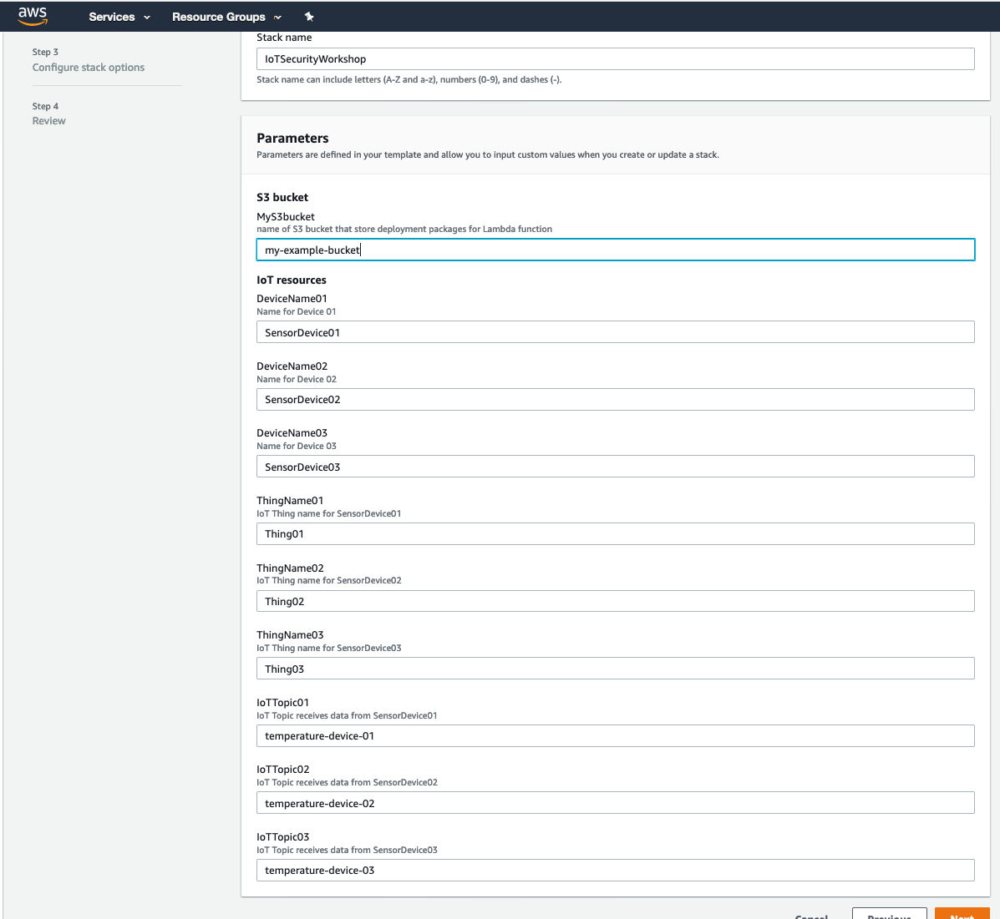

# Module 1: Environment build

Depending on how you're doing this workshop, expand one of the following dropdowns to start.

Click here if you're at an AWS event where the Event Engine is being used
 
  1. If you are at an AWS Sponsored event, you will be provided with either an AWS account or a hash key for Event Engine.
  
  2. To get start, go to [What will be provided](#what-will-be-provided)

Click here if you are using your own AWS account (whether you are at an AWS event, a separate event or online)
 
  
You will need to provision nessesary AWS resources for this lab following these steps:
  
  1.  From AWS Management console, choose a region that works best for you from the top right corner of the console. For example recommend Ohio or Oregon if you're in North America. 
  2. Create a S3 bucket (or use an existing bucket) to store source code. In this workshop, we use CloudFormation to create multiple Lambda functions. We need to provide the S3Bucket name so that CloudFormation can pull the source code to create these Lambda functions. We recommend to use non-production S3 bucket.
  3. Download CloudFormation template [setupinfra.yml](setupinfra.yml)
setupinfra.yml</a> to your local laptop.
  4. Download these source code and upload it to S3 bucket
  
     a. [registerDevice.zip](registerDevice/registerDevice.zip)--> this Lambda function creates X.509 certificate a IAM policies, store it in AWS Secrets Manager.

      b. [staraudit.zip](startaudit/startaudit.zip)--> this Lambda function starts an on-demand Device Defender Audit 

      c. [device.zip](device/device.zip)--> this Lambda function acts as IoT Device.

  5. Create a new CloudFormation stack:
  
      a. From CloudFormation console, click **Create stacks, With new resources (standard)**
      
      b. Choose **Upload a new template**, and upload the CloudFormation template that you download to your local laptop earlier in step 3. Click **Next**
      
      c. Give a name for your CloudFormation stack. Then in Parameter, provide the name of the S3 bucket that you create in step 2. Leave everything as default for other parameter. Click **Next**
      
        

      d. Leave everything by default in **Configure stack options**. Click **Next**
      
      e. Scroll down to **The following resource(s) require capabilities: [AWS::IAM::ManagedPolicy]**. Check the box next to **I acknowledge that AWS CloudFormation might create IAM resources.**. Click **Create stack**. The stack  will take 5-10 minutes to complete.
      

## What will be provided:
In this lab, AWS resources are already created for you in advance:

- 2 IoT Devices registered with AWS IoT
- 1 X.509 Certificate and it's private key stored in AWS Secrets Manager
- 1 on-demand Audit

## Architecture Diagram:

## Validate environment setup

### 1. IoT devices

In this workshop, we will use 2 Lambda functions acting as 2 seperate IoT Devices: SensorDevice01 and SensorDevice02, respectively. Each device will send temperature telemetry to AWS IoT every 10 seconds. Let's look at the code of Lambda functions (writen in Python) by going to Lambda management console, and click on function Device01 or Device02:

First, the function will retrieve [AWS IoT Endpoint](https://docs.aws.amazon.com/iot/latest/developerguide/iot-custom-endpoints.html) to send telemetry data to. To connect with AWS IoT Endpoint, each IoT device needs to have  a X.509 device certificate, private key, and root CA certificate installed. You can register your root CA with AWS IoT. In this workshop, we will use the AWS IoT Root CA. Then Lambda function checks if these files are already available in /tmp. If not, it will retrieve these files from AWS Secrets Manager. Finally, it generates random temperature telemetry data and sends it to AWS IoT Endpoint

### 2. AWS IoT Things

Two IoT Devices above are already registered to AWS IoT. Let's look at how we use AWS IoT to manage these devices. From the IoT Management Console, click on Manage, click on Things:

Click on SensorDevice01 to view more information about this Thing. Now let's look at how this Thing is authenticated to communicate with AWS IoT. On the left column, click on Security:

You will see a X.509 certificate is associated with this thing. When the device initiates connection to AWS IoT, it needs to present to AWS IoT this certificate, and the associated private key, as well as AWS IoT RootCA certificate as device's credentials. This certificate is currently valid and activated.

Now let's click on the certificate to get more details. You can see the ARN (Amazon Resource Name) of the certificate, as well as Create Date, Effective Date (when the cert is activated), and Expiration Date.

On the left side, click on Policies to see permission that this any Thing attached to this certificate can perform. You will see a Policy named DevicePolicy* attached to this cert. This is [AWS IoT policies](https://docs.aws.amazon.com/iot/latest/developerguide/iot-policies.html). It allows you to control access to the AWS IoT data plane. They follow the same conventions as IAM policies. Click on this Policy and you will see the policy document specifies priviledges of the request that your IoT Devices send to AWS IoT.

What do you think about this policy? What would you do to only give appropriate permisison for the Thing associated to this certificate? To get some idea, you can look at [example AWS IoT policies here](https://docs.aws.amazon.com/iot/latest/developerguide/example-iot-policies.html)

### 3. Check if your devices are sending data to AWS IoT

To check device's activity, go to **Manage, Things, SensorDevice01, Activity**. You will see the timestamp of each activities and the json object with details:

Devices publish messages to AWS IoT topic that you create. You can use the AWS IoT MQTT client to subscribe to these topics to see the content of these messages. From IoT management console, click on **Test, Subscribe to a topic** , then type in the topic name that your IoT Devices send telemetry data to, and click "Subscribe to topic". In this workshop, the topic names will be "temperature-device-01" and "temperature-device-02"

Seeing the temperature records? Yay! Your devices are connected and sending data to AWS IoT. That's exciting. Let's move to [Module 2: Audit your IoT Fleet](Module-02:-audit-your-iot-fleet) to find out how you can audit your devices configuration. 
