# Module 2: Audit your IoT Fleet

In Module 1, you validated environment setup for your IoT devices. Your next task is to regularly audit these devices to detect any drifts from security requiremetns for device configuraiton. As a busy Security Engineer, you looks for opportunity to automate audits and mitigations for thousands of IoT devices. This module will show you how to accomplish automation for audit and mitigation actions.

1. [Audit your IoT Fleet](#1-audit-your-iot-fleet)

    1.1 [Check Audit settings](#11-check-audit-settings)
    
    1.2 [Run an On-Demand Audit](#12-run-an-on-demand-audit)

2. [Take actions to mitigate audit findings](#2-take-actions-to-mitigate-audit-findings)

    2.1 [Define mitigation actions](#21-define-mitigation-actions)
    
    2.2 [Apply mitigation actions to audit findings](#22-apply-mitigation-actions-to-audit-findings)

## 1. Audit your IoT Fleet

AWS provides a service called AWS IoT Device Defender to help you looks at account- and device-related settings and policies to ensure security measures are in place. Device Defender provides a tool call Audit. An Audit can help you detect any drifts from security best practices or access policies.

Audit provides [14 type of checks](https://docs.aws.amazon.com/iot/latest/developerguide/device-defender-audit-checks.html). You can configure audit settings in your AWS account to choose which checks will be available when you set up audits. These Settings are effective at regional level. That means, settings in region A will not affect region B. 

An Audit Settings has 3 parts:

* Services permissions: you will need to allow Device Defender to run Audit against your IoT devices. You do so by using an IAM policies to manage permission.
* Enable Audits check: you select checks to make it available for audits. You can enable or disable anytime. Disable a check means that Device Defender will not include that type of check when it run an Audit.
* SNS alerts: This optional session let you choose a SNS topic to receive alerts from Device Defender. Alerts are always displayed in the AWS IoT console.

### 1.1 Check Audit settings

In this module, you will run all of the checks for your IoT devices. You will need to validate if all checks are enabled in settings. Leave all the check enable. Depending on the scenerios below, expand one of the following dropdowns to start

Click here if you're at an AWS event where the Event Engine is being used or you run CloudFormation template in [Module 1](/Module%201:%20Environment%20build) on your AWS account
 
  
   1. If you are at an AWS Sponsored event, an on-demand Audit was created in advanced for you to make sure you can see how an Audit results look like if you can't create an Audit during the event. Thus Audit Settings is already created for you. You can follow steps below to validate Settings
   
   2. Sign in to AWS Account. From the AWS console home, click **IoT Device Defender** to go to IoT console. (You can search this service in the search box if you don't see it)
   
   3. On the left side, click **Defend, Settings** to view current settings 
   
   4. Under **Service permissions**, you will see an IAM role in a format [CloudFormation-stack-name]-IoTAuditRole-[random-value] that gives permission to Device Defender to run audits. This role was create in advance for you using CloudFormation. This IAM role has 1 AWS managed policy **AWSIoTDeviceDefenderAudit** attached to it. Here is how this role looks like in IAM console
   
   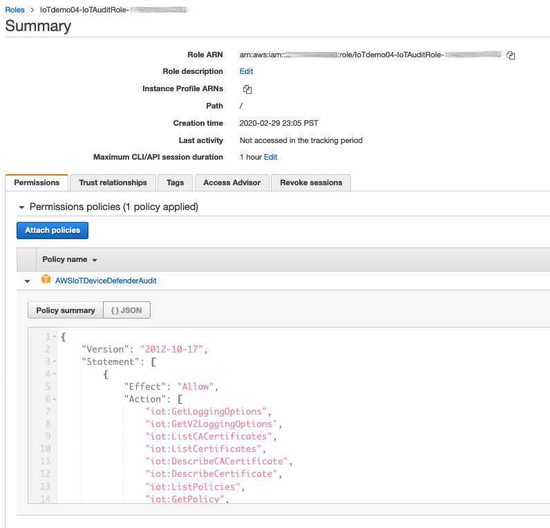

   5. Under **Enable Audit checks**, you will see the list of enabled checks, severity of each checks, and what resources this checks will audit against. Click on the question mark next to the check name to learn more what it does. 
   
   6. To disable any checks, click on the box next to it and click **Disable**. For example, this is how it looks like when you disable 'Logging disabled' and 'CA certificate expiring' check. 
   
   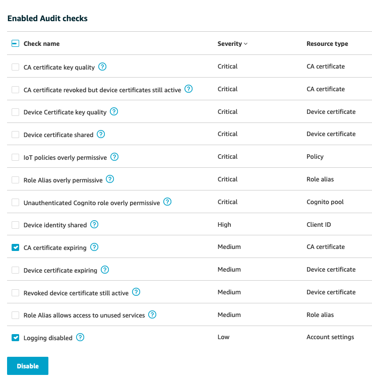

   7. Disabled checks will be listed under **Disabled Audit checks session**. To enable the checks again, check the box next to check name and click **Enable**
   
   7. The final session of Settings is **SNS alerts**. You need to enable SNS alerts to receive audit related alerts from Device Defender. Click on **Edit, Enabled**
   
   8. Under **Topic**, select SNS topic **BadDevices** create previously in [Module 1](/Module%201:%20Environment%20build#available-resources). 
   
   9. Under **Role**, select IAM role with this naming convention [CloudFormation-stack-name]-SNSTopicRole-[random-value]. This role is create by CloudFormation. It has one AWS managed policy **AWSIoTDeviceDefenderPublishFindingsToSNSMitigationAction** 
  
   10. When you're ready, click **Update** to enable SNS alerts. 
   
   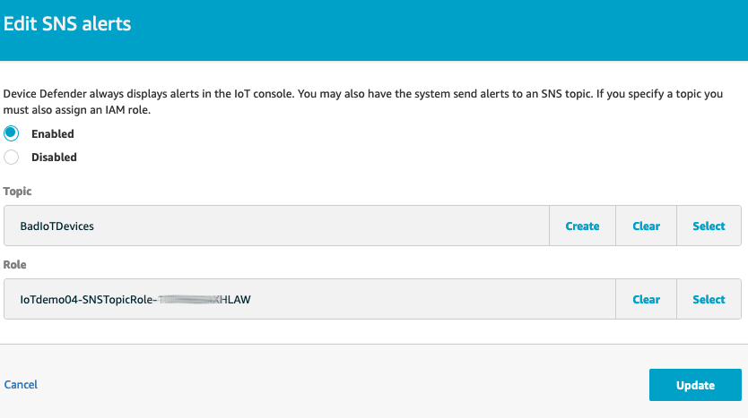

You have completed checking setting for Device Defender Audit. Next step is to create an Audit.
   

Click here if you manually configure Audit Settings very first time
 

If you finished [Module 1](/Module%201:%20Environment%20build) before working on this module, an on-demand Device Defender Audit was created in advance for you. Ignore this option if you're in an AWS event.

If you are not following along with Module 1 and this module, and this is the first time you run a Device Defender Audit, you should follow [instruction in this document](https://docs.aws.amazon.com/iot/latest/developerguide/device-defender-HowToProceed.html). If you use AWS IoT console to start an Audit, follow these steps:

1. Sign in to AWS Account. From AWS console home, click on IoT Device Defender to go to IoT console

2. On the left side of IoT console, click **Defend, Audit, Get started with an audit**

3. You will go through 3 steps to configure settings for Device Defender Audit. Click **Next** to start first steps **Review permissions**

   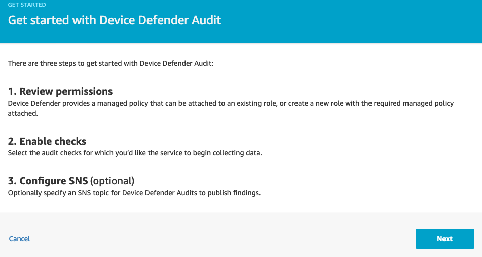

4. In this step, you need to grant Device Defender Audits permisison to run audit against your IoT resources and policies by using IAM Role. This IAM role needs to have AWS managed policy **AWSIoTDeviceDefenderAudit**. You can create this IAM role in advance or click **Create Role** so that Device Defender can create the role for you. Click **Next** to go to **Select checks**

5. Select the checks you want to enable, and click **Next** to go to the next step, **Configure SNS**

6. This optional step let you choose which SNS topic will receive alerts from Device Defender. If you choose **Enabled**, you need to provide SNS topic name and IAM role that allow Device Defender to send alerts to that SNS topic. This IAM role needs to have AWS managed policy **AWSIoTDeviceDefenderPublishFindingsToSNSMitigationAction**.

7. Click **Enable Audit** to start your very first Audit. Note that this first Audit is a daily audit - meaning it will run every day at specific time decided by Device Defender. To create different type of Audit (on-demand, monthly,...), click **Defend, Audit, Schedules, Create**

### 1.2 Run an On-Demand Audit

From the IoT management console, click on **Defend**, **Audit**, **Schedules**. You will then see the current list of scheduled Audits. Click **Create** button on the top right to create a new Audit. From the **Available checks** list, you can enable or disble the checks that you would like to run agains your devices. Click on the question mark next to each check to understand what it will do. In this lab, let's keep all the checks enabled.

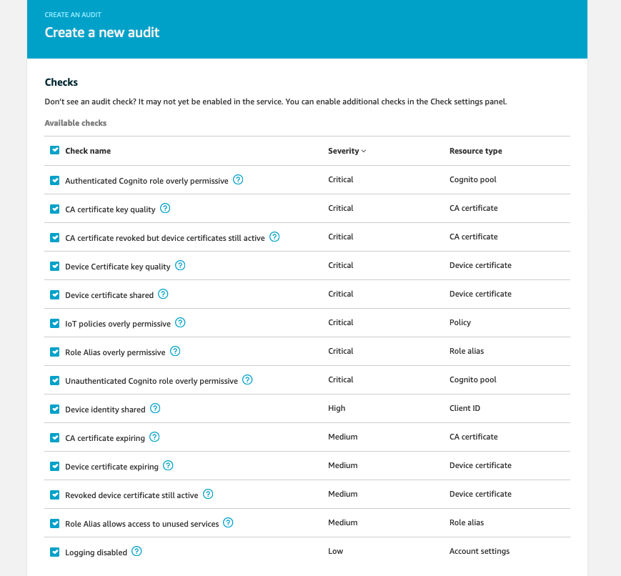

You have options to run Audit daily, weekly, bi-weekly, or monthly. With these options, IoT Device Defender will choose a time to start the audit for you. In this lab, let's choose **Run audit now(once)**. Then click **Create** to start the audit immediately

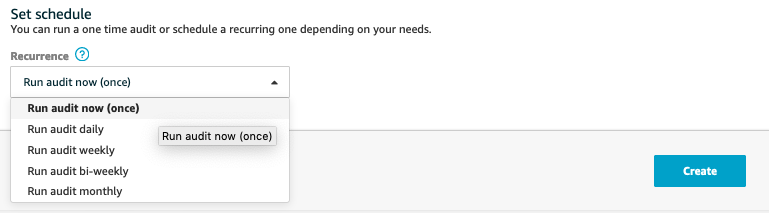

It will take a few minutes for the audit to complete.  

> Note: since we already create an audit for you, and there aren't many IoT devices in this lab, so the new on-demand Audit should complete quickly. In real life, Audit can take longer time to show you results. 

To see audit results, click on **Defend**, **Audit**, **Results** 

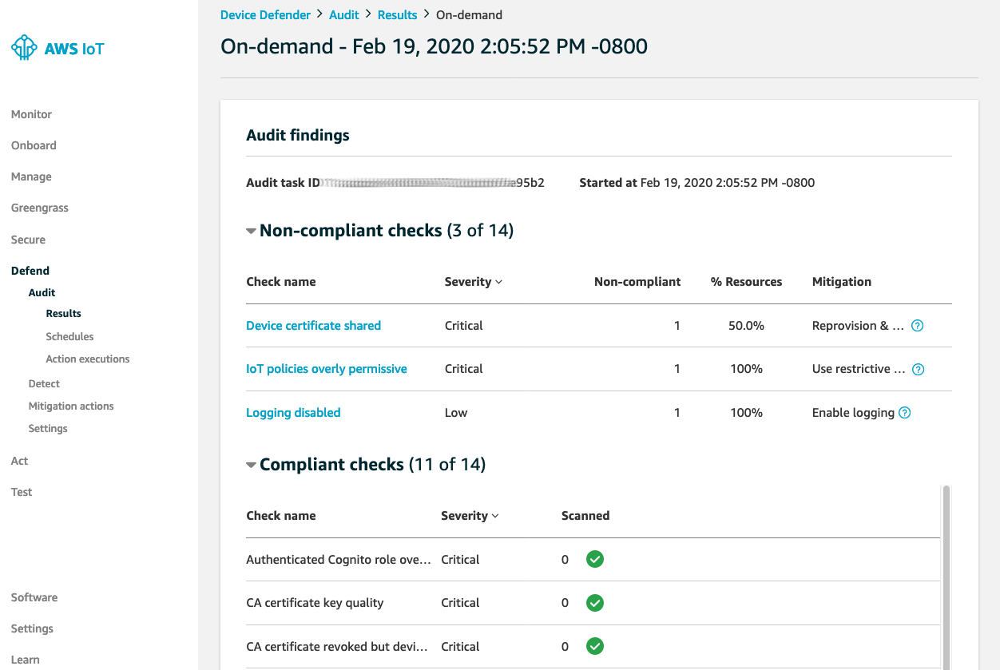

Under **Non-compliant checks**, you should see 3 checks:

- [Device certificate shared](https://docs.aws.amazon.com/iot/latest/developerguide/audit-chk-device-cert-shared.html)
- [IoT policies overly permissive](https://docs.aws.amazon.com/iot/latest/developerguide/audit-chk-iot-policy-permissive.html)
- [Logging disabled](https://docs.aws.amazon.com/iot/latest/developerguide/audit-chk-logging-disabled.html)

To view which resources associate which each findings, click on the check name. For example, click on **Device certificate shared** and you will see the Certificate ID that is being shared between SensorDevice01 and SensorDevice02

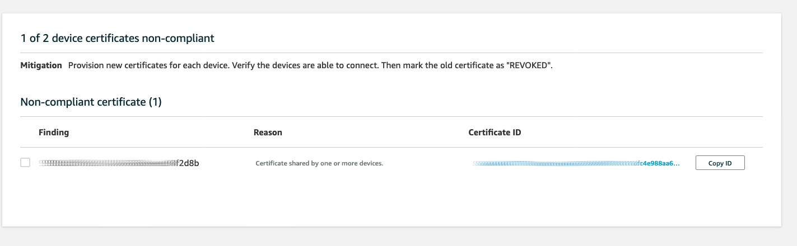

Now we have a list of non-compliant checks, next step we will need to remediate these non-compliant findings

## 2. Take actions to mitigate audit findings

### 2.1 Define mitigation actions

From IoT management console, click **Defend**, **Mitigation Actions**. From the top right conner, click **Create** to create a new Mitigation Actions.

To see the list of supported actions, you can look at [this document](https://docs.aws.amazon.com/iot/latest/developerguide/device-defender-mitigation-actions.html). In this Lab, let's create a Mitigation Actions **Update device certificate** that will take action to deactivate the certificate.

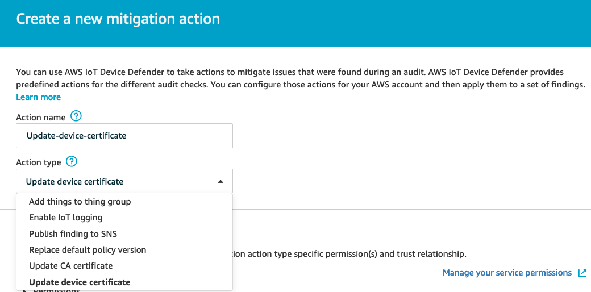

Now, you'll need to give Device Defender permisison to perform this mitigation action. To do so, you create an IAM role or select an existing role that allow action **"iot:UpdateCertificate"** . Since we don't have a role with this permisison, let's ask AWS IoT to create a new one. Click **Create Role** and enter a role name. 

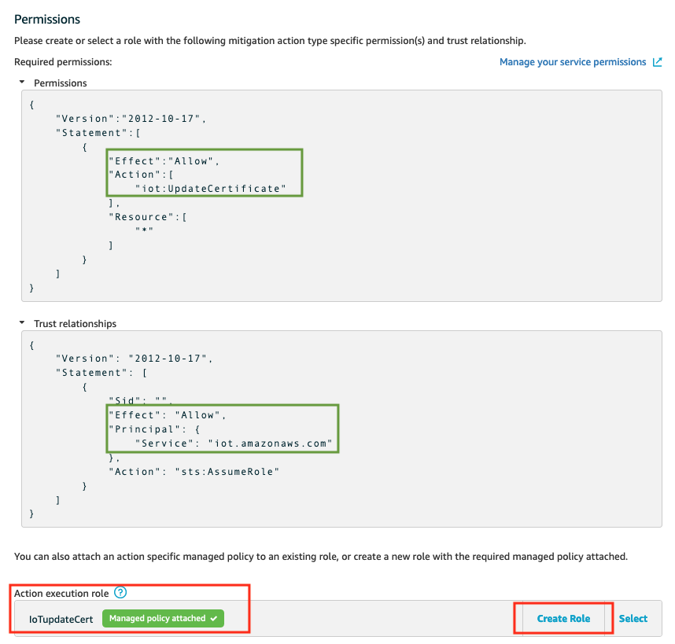

Leave everything else as it is and click **Save**. 

Now we can apply this mitigation actions to the audit findings.

### 2.2 Apply mitigation actions to audit findings

To apply mitigation actions to the audit findings, navigate to **Audit**, **Results**. Click on the **On-demand** audit to view the list of findings.

Under **Non-compliant checks**, click on **Device certificate shared**. Device Defender detects multiple devices are sharing one X.509 certificate. When you click on this check, you will see cerfiticate ID associated to both SensorDevice01 and SensorDevice02.

To apply mitigation actions, check the box next to finding ID, and click **Start Mitigation Action** on the top right corner.

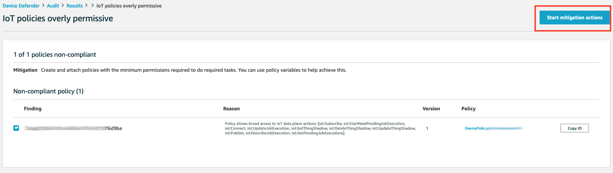

Give a name for this task, then click **Select options for IoT policies overly permissive** to see the drop down lists of actions, and choose the mitigation action you created in the previous step. Then click **Confirm**

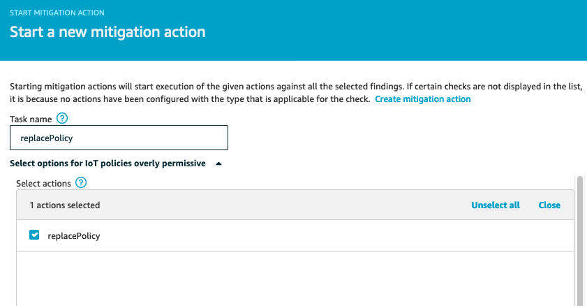

To view the status of mitigation actions task, click on **Defend**, **Action results** It can take a few minutes for the task to complete. Since we use mitigation action **Update device certificate**, Device Defender will deactivate the Certificate. To double check, go to **Secure**, **Certificates**. You should see the certificate is **Inactivate**.

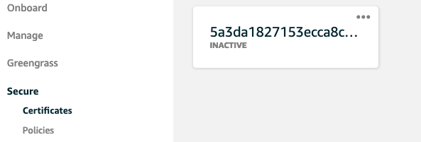

> Note: If you will work on next module [Module 3: Detect and response to a compromised device](../Module%203:%20Detect%20and%20response%20to%20a%20compromised%20device), then you will need to re-activate this certificate.

Congratulations! You have mitigated a non-compliant findings in your device configuration. Let's move to the next module [Module 3: Detect and response to a compromised device](../Module%203:%20Detect%20and%20response%20to%20a%20compromised%20device) where you will build automation to detect if a device is compromised.

