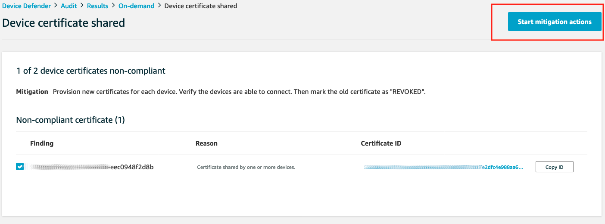

# Module 2: Audit your IoT Fleet

In Module 1, you validated environment setup for your IoT devices. Your next task is to regularly audit these devices to detect any drifts from security requiremetns for device configuraiton. As a busy Security Engineer, you looks for opportunity to automate audits and mitigations for thousands of IoT devices. This module will show you how to accomplish automation for audit and mitigation actions.

1. [Audit your IoT Fleet](#1-audit-your-iot-fleet)

    1.1 [Check Audit settings](#11-check-audit-settings)
    
    1.2 [Run an On-Demand Audit](#12-run-an-on-demand-audit)

2. [Take actions to mitigate audit findings](#2-take-actions-to-mitigate-audit-findings)

    2.1 [Define mitigation actions](#21-define-mitigation-actions)
    
    2.2 [Apply mitigation actions to audit findings](#22-apply-mitigation-actions-to-audit-findings)

## 1. Audit your IoT Fleet

### 1.1 Check audit settings

To get start, you need to identify what type of check you would like to run against your devices. AWS IoT Device Defender has built in audit checks that you can quickly enable. Let's create an audit with these checks.

First, you need to configure  Device Defender Audit settings in your AWS accout. Settings include SNS alerts configuration and which Audit checks are enabled or disabled.  To view settings and enable/disable Audit checks, click **Defend**, **Setting**

After all audit checks are already enabled, we can create an on-demand audit.

> Note: we already created an on-demand audit in advance for you because we would like to show you example results. In this Lab, you will not go through neccessary steps to give permisison to Device Defender to collect data, and to choose SNS topic to send notification. Outside of this Lab, you should follow [instruction in this document](https://docs.aws.amazon.com/iot/latest/developerguide/device-defender-HowToProceed.html) when you run Audit the very first time. 

### 1.2 Run an On-Demand Audit

From the IoT management console, click on **Defend**, **Audit**, **Schedules**. You will then see the current list of scheduled Audits. Click **Create** button on the top right to create a new Audit. From the **Available checks** list, you can enable or disble the checks that you would like to run agains your devices. Click on the question mark next to each check to understand what it will do. In this lab, let's keep all the checks enabled.

You have options to run Audit daily, weekly, bi-weekly, or monthly. With these options, IoT Device Defender will choose a time to start the audit for you. In this lab, let's choose **Run audit now(once)**. Then click **Create** to start the audit immediately

It will take a few minutes for the audit to complete.  

> Note: since we already create an audit for you, and there aren't many IoT devices in this lab, so the new on-demand Audit should complete quickly. In real life, Audit can take longer time to show you results. 

To see audit results, click on **Defend**, **Audit**, **Results** 

Under **Non-compliant checks**, you should see 3 checks:

- [Device certificate shared](https://docs.aws.amazon.com/iot/latest/developerguide/audit-chk-device-cert-shared.html)
- [IoT policies overly permissive](https://docs.aws.amazon.com/iot/latest/developerguide/audit-chk-iot-policy-permissive.html)
- [Logging disabled](https://docs.aws.amazon.com/iot/latest/developerguide/audit-chk-logging-disabled.html)

To view which resources associate which each findings, click on the check name. For example, click on **Device certificate shared** and you will see the Certificate ID that is being shared between SensorDevice01 and SensorDevice02

Now we have a list of non-compliant checks, next step we will need to remediate these non-compliant findings

## 2. Take actions to mitigate audit findings

### 2.1 Define mitigation actions

From IoT management console, click **Defend**, **Mitigation Actions**. From the top right conner, click **Create** to create a new Mitigation Actions.

To see the list of supported actions, you can look at [this document](https://docs.aws.amazon.com/iot/latest/developerguide/device-defender-mitigation-actions.html). In this Lab, let's create a Mitigation Actions **Update device certificate** that will take action to deactivate the certificate.

Now, you'll need to give Device Defender permisison to perform this mitigation action. To do so, you create an IAM role or select an existing role that allow action **"iot:UpdateCertificate"** . Since we don't have a role with this permisison, let's ask AWS IoT to create a new one. Click **Create Role** and enter a role name. 

Leave everything else as it is and click **Save**. 

Now we can apply this mitigation actions to the audit findings.

### 2.2 Apply mitigation actions to audit findings

To apply mitigation actions to the audit findings, navigate to **Audit**, **Results**. Click on the **On-demand** audit to view the list of findings.

Under **Non-compliant checks**, click on **Device certificate shared**. Device Defender detects multiple devices are sharing one X.509 certificate. When you click on this check, you will see cerfiticate ID associated to both SensorDevice01 and SensorDevice02.

To apply mitigation actions, check the box next to finding ID, and click **Start Mitigation Action** on the top right corner.

Give a name for this task, then click **Select options for IoT policies overly permissive** to see the drop down lists of actions, and choose the mitigation action you created in the previous step. Then click **Confirm**

To view the status of mitigation actions task, click on **Defend**, **Action results** It can take a few minutes for the task to complete. Since we use mitigation action **Update device certificate**, Device Defender will deactivate the Certificate. To double check, go to **Secure**, **Certificates**. You should see the certificate is **Inactivate**.

> Note: If you will work on next module [Module 3: Detect and response to a compromised device](../Module%203:%20Detect%20and%20response%20to%20a%20compromised%20device), then you will need to re-activate this certificate.

Congratulations! You have mitigated a non-compliant findings in your device configuration. Let's move to the next module [Module 3: Detect and response to a compromised device](../Module%203:%20Detect%20and%20response%20to%20a%20compromised%20device) where you will build automation to detect if a device is compromised.

