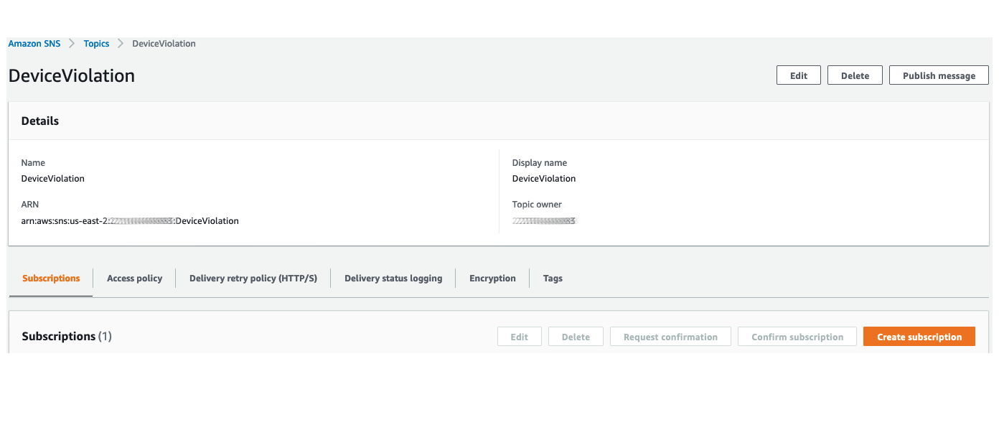

# Module 3: Detect and response to unusual behaviors of your devices

In Module 2, you learned how to set up automation to audit devices configuration and implement mitigation actions. With additional security requirements from your IT organization, you need to have a solution in place to detect unusual behaviors of IoT devices, which can indicate that devices are compromised and participate in bad activities (for example, participate in a DDoS attack). You also need to find a solution to quickly response to this changes in device's behaviors. Becuase these IoT devices are used to send temperature telemetry, you identify one behavior indicates that a device is compromised: sending very large message compared to the regular message, which only has temperature telemetry.

This module will walk you through neccessary steps to build solutions for requirements above by following these steps.

1. [Define unusual behaviors of your devices](#1-define-unusual-behaviors-of-your-devices)
2. [Respond to a violation](#2-respond-to-a-violation)
3. [Simulate a compromised device](#3-simulate-a-compromised-device)


## 1. Define unusual behaviors of your devices

Your first task is to implement a solution to detect unusual behaviors of IoT devices. How do you know if devices act differently than its regular behavior? You need to have metrics related to device's activities, and you need to define when the value of each metric is considered outside of regularity.

AWS IoT Device Defender Detect looks at cloud-side metrics (from AWS IoT) and device-side metrics (from agents you install on your devices), and help you detect changes in these metrics. However, you need to tell Device Defender when these metrics aren't normal and need human's attention.

To do that, you need to create a **Security Profile**. A security profile defines anomalous behaviors for a group of devices (a thing group) or for all devices in your account, and specifies which actions to take when an anomaly is detected. 

In this case, you will create a Security Profile to allow Device Defender monitor message size of devices SensorDevice01 and SensorDevice02. The Software Developer Teams shared with you that each message size is around 120bytes, and devices send 6 messages in 1 minute (equivilant to 1 message/10 seconds). That means, each device should not send more than 720bytes in 1 minute. Now you can use this data point as a threashold for Security Profile.

1. Sign in to your AWS account. From AWS console home, go to IoT console

2. On the left side of IoT Console, Click **Defend, Detect, Security Profiles, Create your first security profile**. Name this security profile as **DetectLargeMessageSize**. 

3. Under **Behaviors**, create a behavior named **LargeMessageSize**. We ask Device Defender to observe message size and alert us it transmits messages whose cumulative size is more than 1000bytes in a minute. 

4. Click on drop down list under **Metric**, and choose metric **Message Size**. Choose **Check Type** as **Absolute Value**. That means an alarm occurs for a device if a specify number of message cross the threshold. If you choose **Statistical Threshold**, an alarm occurs for a device if, during specific number of consecutive five-minute periods, it transmits messages whose cumulative size is more than that measured for 90 percent of all other devices reporting for this security profile behavior. For simplicity, keep Check Type as **Absolute Value** for now.

5. For **Operator**, choose **Greater than**. Specify **1000** for **Value**.

6. For **Datapoints to Alarm**, specify **6**. Because you choose **Absolute Value** as Check Type, each message size is one datapoint. After 6 datapoints, the alarm will occur.

7. For **Datapoints to Clear**, specify **6**. That means the alarm is cleared if the offending device is no longer in violation of this behavior for 6 conservative datapoints.


8. You need to keep the mesage size metrics of each message for investigation. Under **Addionional Metrics to retain**, click on **Select** on the right corner to see drop down list of metrics that we can retain. Select **Message size**. You also need to keep track of how many messages are sent and received between AWS IoT and each device in a given period. To keep this metric, select **Message received**. Then click **Next**

9. Select a SNS topic for alerts when a device violates a behavior in this profile. An SNS topic was created for you in advance. This step is similar to [Module 2, session 1.1, Option 1, step 9 and 10](/Module%202:%20Audit%20your%20IoT%20Fleet/README.md#11-check-audit-settings). Select SNS topic **BadDevices**. For IAM Role, select IAM role with this naming convention [CloudFormation-stack-name]-SNSTopicRole-[random-value]. If you worked on Module 2 of this workshop, you should already subcribed your email to this topic **BadDevices**. If you haven't subscribed your email, don't forget to do so.


10. You need to attach this security profile to a target. A target can be a thing, or a thing group. For simplicity, we will attach this security profile with **All things** for now.


Click **Next** to view summary of this Security Profile. When you confirm everything is correct, then click **Save**

## 2. Respond to a violation

In this example, we will create a simple automation that will move violated device to a thing group specifically for investigation. We attach a **Deny all** IAM policies to this thing group so that the devices do not have any permision to perform any iot actions.

### 2.1 Create IoT Thing Group denies all IoT actions

From IoT management console, click **Manage**, **Thing groups**, **Create**, **Create Thing Group** . Name your thing group and click **Create thing group**


Now let's create a policy that deny all IoT actions. Click on **Secure, Policies, Create**. Name your new policy. Under Add statements, type **iot:*** for **Action**, and **'\*'** for **Resource ARN**. Check **Deny** box, and click **Create**. 
> Note that this policy only denies all IoT actions. If your devices have addtional permission to work with others AWS Services (for example, permission to Put an item in DynamoDB table), this policy won't deny those permission.


Next, you will associate this policy with Thing Group that we create earlier. Go to **Manage, Thing groups, Security, Edit**. Select the policy that you create earlier, and click **Save**


Any device in this Thing Group will not have permission to send data to AWS IoT.

### 2.2 Create Lambda function to move device into thing group

In this step, we create a Lambda function to move offending device to **IsolatedDevices** thing group for forensic. When Device Defender finds a violation and sends alerts to SNS topic that you created earlier, SNS will trigger this Lambda function.

> Note: in this Lab, we expect to have 1 violation, which mean the Lambda function will be trigger once. Before implemenet this solution, we recommend you to test thoroughly to make sure this is an appropriate solution for you.

Go to Lambda management console, click **Create function**. Choose **Author from scratch**, and give a name to your function. Choose Runtime as **Node.js 12.x** and leave Permission as default - **Create a new role with basic Lambda permissions** (we will need to update this role later). When ready, click **Create function**


Replace default code in index.js by the block of code below. Remembe to click **Save** to save this change:

```python
import boto3
import json

iot = boto3.client('iot')

def lambda_handler(event, context):
	message = event['Records'][0]['Sns']['Message']
	d = json.loads(message)
	thing = d['thingName']

	addThing = iot.add_thing_to_thing_group(
    	thingGroupName='IsolatedDevices',
	thingName=thing
	)
```
Now let's update the execution role of this Lambda function. We need to allow this function to attach a Thing to a Thing Group. Scroll down to **Execution Role**. Under **Existing role**, you will see the role name associated to this function.


Click on the link below to view this role in IAM console. Click **Attach policies**, search for **AWSIoTFullAccess** and attach this managed policy to the role. You can choose to scope down permission by create a customer manage policy and attach it to the role if you're very comfortable with building IAM policy.

After updating your IAM role, let's subscribe this function to SNS topic. From SNS console, click **Topics**. From the list of topics, click the topic that you create earlier. Click **Create subscription**



Choose **AWS Lambda** for Protocal. For Endpoint, choose the Lambda function that you just created. Click **Create subscription**


Now let's do the fun part: test this automation

## 3. Simulate a compromised device 

In this step, we will update SensorDevice02's code to similate a situation that it is compromised, and it is sending way too much data as it should be. 

### 3.1 Update message size

To update the amount of data SensorDevice02 is sending to AWS IoT, go to Lambda management console, click on function **Device02**. Scroll down to edit the code that generate random temperature telemetry data (line 55):

```
	deviceTemperature = round(random.uniform(15.1,29.9),2)
```
This telemetry data is usually 120bytes. Let's replace the line of code above with a very long big text to purposely increase it's size


> deviceTemperature = "AWS IoT Device Defender is a security service that allows you to audit the configuration of your devices, monitor connected devices to detect abnormal behavior, and mitigate security risks. It gives you the ability to enforce consistent security policies across your AWS IoT device fleet and respond quickly when devices are compromised. IoT fleets can consist of large numbers of devices that have diverse capabilities, are long-lived, and are geographically distributed. These characteristics make fleet setup complex and error-prone. And because devices are often constrained in computational power, memory, and storage capabilities, this limits the use of encryption and other forms of security on the devices themselves. Also, devices often use software with known vulnerabilities. These factors make IoT fleets an attractive target for hackers and make it difficult to secure your device fleet on an ongoing basis.AWS IoT Device Defender addresses these challenges by providing tools to identify security issues and deviations from best practices. AWS IoT Device Defender can audit device fleets to ensure they adhere to security best practices and detect abnormal behavior on devices. "


Click on **Save** on the top right corner to save this change. After this change, each message Lambda function sent to AWS IoT will be ~1.3KB

Now we wait for a few minutes until you receive email from SNS. After that you can go to **Manage, Thing Groups, IsolatedDevices, Things** to see that **SensorDevice02** should be added to this group. Now let's check if this device has stopped sending telemetry data by going to **Test, Subscribe to a topic**, enter the topic **temperature-device-02**. 

If your automation in step 2 works. You shouldn't see any message there because we have associated **DenyAll** policy to Thing Group **IsolatedDevices**

Congratulations! You have succesfully completed this Lab. 
