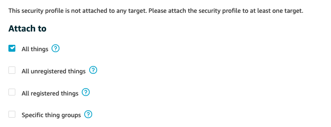

1. [Define unusual behaviors of your devices](#define-unusual-behaviors-of-your-devices)
2. [Respond to a violation](##respond-to-a-violation)
3. [Simulate a compromised device](#simulate-a-compromised-device)

After you have identify potential external threats to your IoT devices, it's crucial to implement a solution to quickly detec if the devices are compromised, and take action to stop the attack. In this lab, your task is to detect if the device participate in a DDoS attack and becomes the source of the actack.

To do so, you will need to define when the devices' behaviors will be considered abnormal and need a human attention to check if it's actually compromised. So let's use AWS IoT Device Defender Detect for that.

## 1. Define unusual behaviors of your devices

You realizes that you can use 2 device metrics to detect if the devices are acting strangely: how much data the device is sending, and the freqency of sending. Now you can tell Device Defender to monitor these two metrics, and alert you if it's out of the threadhold that you define. A combination of anomalous behaviors and actions to take when abnomoly behavior is detected is called **Security Profile**

From the IoT management console, click **Defend**,**Detect**, **Security Profiles**, **Create your first security profile**. Name this security profile as **LargeMessageSize**.

Create a behavior named **messageSize**. We ask Device Defender to observe **Message size** metric and alert us if the size of the message going out of the device is greater than 35000 bytes - which is larger than the regular message size that SensorDevice01 and SensorDevice02 usually send to AWS IoT. And if a device is in violation of this behavior for two datapoints, then the alarm will be trigger. For **Datapoints to Clear**, we choose to clear the alarm if the offending device is no longer in violation of this behavior for 2 conservative datapoints.


We also need to keep relevant metrics for investigation. Under **Addionional Metrics to retain**, click on **Select** on the right corner to see drop down list of metrics that we can retain. In this lab, we'll choose **Established TCP connections count**, **Message size**, and **Message received**. Then click **Next**

Next step is to select a SNS topic for alerts when Device Defender alerts a violation. Choose the SNS topic and IAM role that you created in step 0.


> You will need to create IAM role in advance. Make sure that the IAM role will need to grant permission for Device Defender to publish to this topic. Attach **AWSIoTDeviceDefenderPublishFindingsToSNSMitigationAction** managed policy to this role should be efficient.
> Don't forget to subscribe your email to this new SNS topic to receive an email when Device Defender alerts a violation.

Now you need to attach this security profile to a target. A target can be a thing, or a thing group. For simplicity, we will attach this security profile with **All things** for now.



Click **Next** to view summary of this Security Profile. When you confirm everything is correct, then click **Save**

## 2. Respond to a violation

In this example, we will create a simple automation that will move violated device to a thing group specifically for investigation. We attach a **Deny all** IAM policies to this thing group so that the devices do not have any permision to perform any iot actions.

### 2.1 Create IoT Thing Group with deny all permission

From IoT management console, click **Manage**, **Thing groups**, **Create**, **Create Thing Group** . Name your thing group and click **Create thing group**


Now let's create a policy that deny all actions. Click on **Secure, Policies, Create**. Name your new policy. Under Add statements, type **iot:*** for **Action**, and **'\*'** for **Resource ARN**. Check **Deny** box, and click **Create**


Next, you will associate this policy with Thing Group that we create earlier. Go to **Manage, Thing groups, Security, Edit**. Select the policy that you create earlier, and click **Save**


Any device in this Thing Group will not have permission to send data to AWS IoT.

### 2.2 Create Lambda function to move device into thing group

In this step, we create a Lambda function to move offending device to **IsolatedDevices** thing group for forensic. When Device Defender finds a violation and sends alerts to SNS topic that you created earlier, SNS will trigger this Lambda function.

> Note: in this Lab, we expect to have 1 violation, which mean the Lambda function will be trigger once. Before implemenet this solution, we recommend you to test thoroughly to make sure this is an appropriate solution for you.

Go to Lambda management console, click **Create function**. Choose **Author from scratch**, and give a name to your function. Choose Runtime as **Node.js 12.x** and leave Permission as default - **Create a new role with basic Lambda permissions** (we will need to update this role later). When ready, click **Create function**


Replace default code in index.js by the block of code below. Remembe to click **Save** to save this change:

```python
import boto3
import json

iot = boto3.client('iot')

def lambda_handler(event, context):
	message = event['Records'][0]['Sns']['Message']
	d = json.loads(message)
	thing = d['thingName']

	addThing = iot.add_thing_to_thing_group(
    	thingGroupName='IsolatedDevices',
	thingName=thing
	)
```
Now let's update the execution role of this Lambda function. We need to allow this function to attach a Thing to a Thing Group. Scroll down to **Execution Role**. Under **Existing role**, you will see the role name associated to this function.


Click on the link below to view this role in IAM console. Click **Attach policies**, search for **AWSIoTFullAccess** and attach this managed policy to the role. You can choose to scope down permission by create a customer manage policy and attach it to the role if you're very comfortable with building IAM policy.

After updating your IAM role, let's subscribe this function to SNS topic. From SNS console, click **Topics**. From the list of topics, click the topic that you create earlier. Click **Create subscription**


Choose **AWS Lambda** for Protocal. For Endpoint, choose the Lambda function that you just created. Click **Create subscription**


Now let's do the fun part: test this automation

## 3. Simulate a compromised device 

In this step, we will update SensorDevice02's code to similate a situation that it is compromised, and it is sending way too much data as it should be. 

### 3.1 Update message size

To update the amount of data SensorDevice02 is sending to AWS IoT, go to Lambda management console, click on function **Device02**. Scroll down to edit the code that generate random temperature telemetry data (line 55):

```
	deviceTemperature = round(random.uniform(15.1,29.9),2)
```
This telemetry data is usually 120bytes. Let's replace the line of code above with a very long big text to purposely increase it's size


> deviceTemperature = "AWS IoT Device Defender is a security service that allows you to audit the configuration of your devices, monitor connected devices to detect abnormal behavior, and mitigate security risks. It gives you the ability to enforce consistent security policies across your AWS IoT device fleet and respond quickly when devices are compromised. IoT fleets can consist of large numbers of devices that have diverse capabilities, are long-lived, and are geographically distributed. These characteristics make fleet setup complex and error-prone. And because devices are often constrained in computational power, memory, and storage capabilities, this limits the use of encryption and other forms of security on the devices themselves. Also, devices often use software with known vulnerabilities. These factors make IoT fleets an attractive target for hackers and make it difficult to secure your device fleet on an ongoing basis.AWS IoT Device Defender addresses these challenges by providing tools to identify security issues and deviations from best practices. AWS IoT Device Defender can audit device fleets to ensure they adhere to security best practices and detect abnormal behavior on devices. "


Click on **Save** on the top right corner to save this change. After this change, each message Lambda function sent to AWS IoT will be ~1.3KB

Now we wait for a few minutes until you receive email from SNS. After that you can go to **Manage, Thing Groups, IsolatedDevices, Things** to see that **SensorDevice02** should be added to this group. Now let's check if this device has stopped sending telemetry data by going to **Test, Subscribe to a topic**, enter the topic **temperature-device-02**. 

If your automation in step 2 works. You shouldn't see any message there because we have associated **DenyAll** policy to Thing Group **IsolatedDevices**


Congratulations! You have succesfully completed this Lab. 
