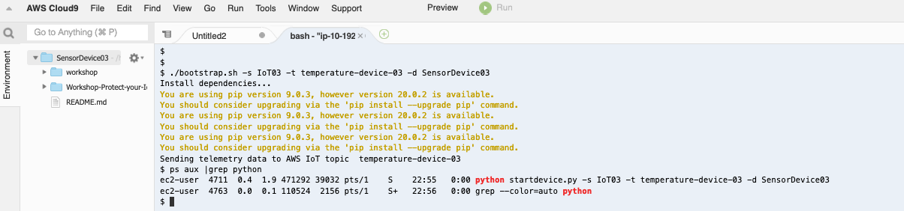
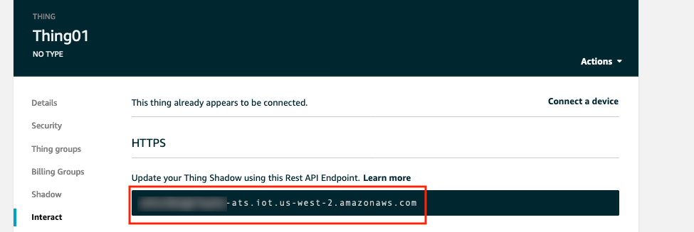
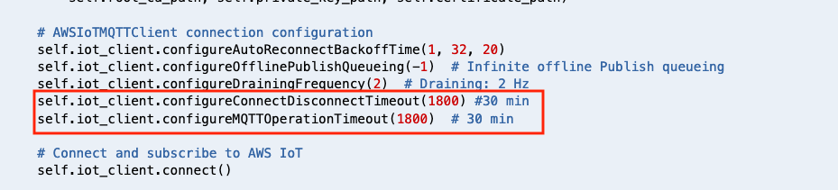
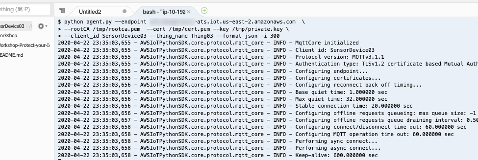
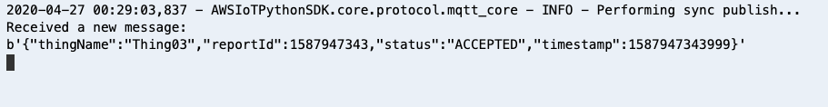

# Module 4: Detect a compromised device using device-side metrics 

In previous module, you used cloud-side metrics capture by AWS IoT to monitor and detect if a device has an abnormal behavior. You also built a solution to automatically isolate the device for quarantine.In this module you will learn how to monitor and stop suspicious device from any actions, by using metrics capture from the device itself. 

## 1. Configure SensorDevice03 to send telemetry data to AWS IoT

Device SensorDevice03 hasn't sent any temperature data to AWS IoT. In this step, you will need to start a bootstrap script on the device. This script will generate random temperature data and send it to AWS IoT endpoint.

1. Open your Cloud9 environment. From Cloud9 environment terminal, go to directory below to run bootstrap script:
      
        cd /home/ec2-user/environment
        git clone https://github.com/hongpham/Workshop-Protect-your-IoT-fleet.git
        cd Workshop-Protect-your-IoT-fleet/
        cd 'Module 5: Send security alerts to your favourite messaging platform'
        
**After repo is published, use CFN to download repo to Cloud9 during provisioning. Need to update git repo name after it's published. Also need to put a screen shot of these command.**

2. Run script bootstrap.sh to install dependencies and make this device to send data to AWS IoT (make sure you are at directory 'Module 5: Send security alerts to your favourite messaging platform'). In this workshop, the default topic name is **temperature-device-03**, default device name is **SensorDevice03**. See screenshot in step 4 for an example. 

        ./bootstrap.sh -t [topic name] -d [device name]
        
3. The script will write AWS IoT Endpoint to a temporary file under /tmp/endpoint. You will need this endpoint later. 

4. This bootstrap script will start a python program in the background to send data to AWS IoT topic **temperature-device-03**. To validate if this device is sendind telemetry data, you can check if the script is running by the command below.
        
         px aux |grep python   #this command search for the current running processes that has 'python' in it's name
         
If you see a process like **'python startdevice.py -t [topic name] -d [device name]**, this device is sending telemetry data to AWS IoT.
 

  
## 2. Install AWS Device Defender Agent to collect metrics on the device

In this step, you will install [AWS Device Defender Agent (Python version)](https://github.com/aws-samples/aws-iot-device-defender-agent-sdk-python) on this device **SensorDevice03**

1. Run these commands to install Agent

         cd /home/ec2-user/environment/workshop
         sudo pip install -r requirements.txt 
         sudo pip install AWSIoTDeviceDefenderAgentSDK
         
2. Open a text editor, retrieve neccesary parameters below and save it in your text editor. You will need these parameters to start Device Defender Agent

      a. AWS IoT Endpoint: when you run bootstrap.sh script to bootstrap the device, the script retrieve AWS IoT endpoint and save it under /tmp/endpoint. In the terminal, you can run the command  below to retrieve the endpoint:
       
          cat /tmp/endpoint
          
 
   **

Click here if you can't find AWS IoT endpoint in /tmp/endpoint
 **
  
     1. If you don't have AWS IoT Endpoint in file /tmp/endpoint, you can retrieve it manually from AWS IoT Console.

     2. Go to **AWS IoT Core console**. Make sure that you are in the correct region. Click **Manage** to view list of IoT things. Click on any thing, for example **Thing01**. Click **Interact**. Copy the Rest API endpoint under **HTTPS**
    
        

   

   
   
    b. Device name: in this workshop, default device name is  **SensorDevice03**
    
    c. Thing name: in this workshop, default thing name is **Thing03**

3. Extend Agent Connection timeout: the minimum interval to send device metrics to Device Defender is 5 minutes (300 s). In this workshop, to make sure the established connection between device and AWS IoT will not be closed when the Agent is collecting data, you will need to increase ConnectionTimeout
      
      a. Make sure you are in directory AWSIoTDeviceDefenderAgentSDK. Change timeout configuration by editing agent.py 
      
        cd /home/ec2-user/environment/workshop/AWSIoTDeviceDefenderAgentSDK
        vi agent.py
        
      b. Change the values of **configureConnectDisconnectTimeout** and **configureMQTTOperationTimeout** to **1800** seconds (30 minutes) 
      
      

      c. Save and close agent.py by pressing **Esc** on the keyboard, then type **:wq**
      
4. Start Device Defender Agent by running this command
        
        python agent.py --endpoint [your AWS IoT endpoint retrieved from step 2.a above]  \
        --rootCA /tmp/rootca.pem  --cert /tmp/cert.pem --key /tmp/private.key \
        --client_id [Device name] --thing_name [Thing name] --format json -i 300

If you notice, you will see that X.509 certificate and it's private key is requried to start Device Defender Agent. These are credentials the Agent will use to send to AWS IoT. These credentials are already download for you under /tmp directory.

The Agent will collect metrics and sends to AWS IoT as json format every 300 seconds (or 5 minutes - which is minimum reporting interval)

5. After a few minutes, you should see a message confirm that Agent is sending metrics data to AWS IoT

Let the Agent run for a 10-15 minutes. Move to next step to configure device behaviors on Device Defender.

## 3. Define unusall behaviors

## 4. Respond to violations

## 5. Simulate a compromised device
