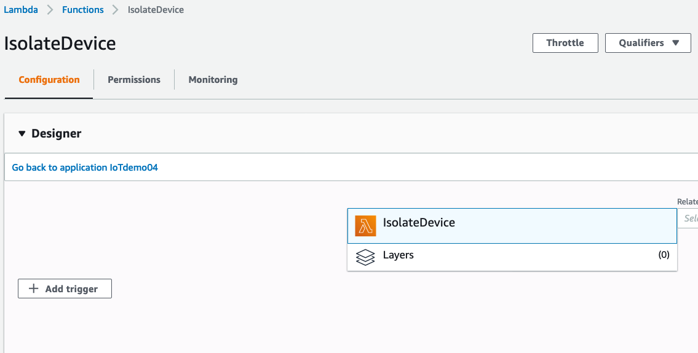
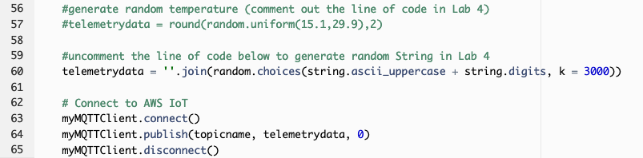

# Module 3: Detect a compromised device using cloud-side metrics

In Module 2, you learned how to set up automation to audit devices configuration and implement mitigation actions. With additional security requirements from your IT organization, you need to have a solution in place to detect unusual behaviors of IoT devices, which can indicate that devices are compromised and participate in bad activities (for example, participate in a DDoS attack). You also need to find a solution to quickly response to this changes in device's behaviors. Becuase these IoT devices are used to send temperature telemetry, you identify one behavior indicates that a device is compromised: sending very large message compared to the regular message, which only has temperature telemetry.

This module will walk you through neccessary steps to use metrics collected by AWS IoT (cloud-side metrics) to detect a compromised devices.

1. [Define unusual behaviors of your devices](#1-define-unusual-behaviors-of-your-devices)
2. [Respond to a violation](#2-respond-to-a-violation)
3. [Simulate a compromised device](#3-simulate-a-compromised-device)

## 1. Define unusual behaviors of your devices

Your task is to implement a solution to detect unusual behaviors of IoT devices. How do you know if a device acts differently than its regular behavior? You need to have metrics related to the device's activities, and you need to define when the value of each metric is considered outside of regularity.

AWS IoT Device Defender Detect monitor cloud-side metrics to detect abnormal behaviors (such as the number of authorization failures, or the number or size of messages a device sends or receives through AWS IoT). However, you need to tell Device Defender when these metrics aren't normal.

To do that, you need to create a **Security Profile**. A security profile defines abnomal behaviors for a group of devices (a thing group) or for all devices in your account, and specifies what actions to take when an anomaly is detected. 

In this case, you will create a Security Profile to allow Device Defender to monitor the message size of all three devices. The Software Development Team didn't share with you average message size of each message. But Device Defender can use [statisticalThreshold](https://docs.aws.amazon.com/iot/latest/developerguide/device-defender-detect.html#detect-behaviors) to detect if incoming messages are larger then the average message size. 

* Sign in to your AWS account. From AWS console home, go to IoT console

*  On the left side of IoT Console, Click **Defend, Detect, Security Profiles, Create your first security profile**. Name this security profile as **DetectLargeMessageSize**. 

*  Under **Behaviors**, create a behavior named **LargeMessageSize**. We ask Device Defender to observe message size and alert us it transmits messages whose cumulative size is more than 1000bytes in a minute. 

*  Click on drop down list under **Metric**, and choose metric **Message Size**. Choose **Check Type** as **Statistical Threshold**. 

*  For **Operator**, choose **Greater than**. Specify **p50** for **Statistical Threshold**. That means, the criteria to trigger alert is when the incoming message size is larger than the 50% of all measurements.

*  Choose **5 minutes** for **Duration**. For a Statistical Threshold check type, this is the time window during which metrics are collected from all devices to determine the statistical ranking of the data from an individual device.

*  For **Datapoints to Alarm**, specify **1**. If a device is in violation of this behavior for 1 datapoints, an alarm occurs.

*  For **Datapoints to Clear**, specify **1**. If an alarm has occured, and the offending device is no longer in violation of the behavior for 1 consecutive datapoints, the alarm is cleared.


*  You need to keep the mesage size metrics of each message for investigation. Under **Addionional Metrics to retain**, click on **Select** on the right corner to see drop down list of metrics that we can retain. Select **Message size**. You also need to keep track of how many messages are sent and received between AWS IoT and each device in a given period. To keep this metric, select **Message received**. Then click **Next**

*  Select a SNS topic for alerts when a device violates a behavior in this profile. An SNS topic was created for you in advance. This step is similar to [Module 2, session 1.1, Option 1, step 9 and 10](/Module%202:%20Audit%20your%20IoT%20Fleet/README.md#11-check-audit-settings). Select SNS topic **BadIoTDevices-[CloudFormation stackname]**. For IAM Role, select IAM role with this naming convention **[CloudFormation-stack-name]-SNSTopicRole-[random-value]**. If you worked on Module 2 of this workshop, you should already subcribed your email to this topic **BadIoTDevices-[CloudFormation stackname]**. If you haven't subscribed your email, don't forget to do so.


*  You need to attach this security profile to a target. A target can be a thing, or a thing group, or every devices. For simplicity, we will attach this security profile with **All things** for now.


Click **Next** to view summary of this Security Profile. When you confirm everything is correct, then click **Save**

## 2. Respond to a violation

After you figure out how to detect unusual device's behaviors, next step is to respond to this violation. 

This session walk you through how to create a simple automation that will move violated device to an IoT Thing Group specifically for investigation. You attach an IAM policy to this Thing Group so that the devices in this Thing Group do not have any permision to perform any IoT actions.

### 2.1 Create IoT Thing Group that denies all IoT actions

*  Sign in to your AWS account, click on IoT Device Defender.
*  From IoT management console, click **Manage**, **Thing groups**, **Create**, **Create Thing Group** . Name your thing group  as **IsolatedDevices** and click **Create thing group**


*  Next, create a policy that deny all **IoT actions** 

*  Go back to main AWS IoT console, click on **Secure, Policies, Create**. Name your new policy. 

*  Under **Add statements**, type **iot:*** for **Action**, and **'\*'** for **Resource ARN**. Check **Deny** box, and click **Create**. 

**Note that this policy only denies all IoT actions. If your devices have additional permission to work with others AWS services (for example, permission to Put an item in DynamoDB table), this policy won't deny those permission.**


*  Associate this policy with Thing Group that we create earlier. Go to **Manage, Thing groups**. Click on the Thing Group **IsolatedDevices, Security, Edit**. Select the policy that you create earlier, and click **Save**


Any device in Thing Group **IsolatedDevices** will not have permission to send data to AWS IoT.

Next, you use a Lambda function to move offending devices to this Thing Group

### 2.2 Use Lambda function to move device into Thing Group

In this step, you use a Lambda function to move offending device to **IsolatedDevices** thing group for forensics. When Device Defender finds a violation and sends alerts to SNS topic that you created earlier, SNS will trigger this Lambda function.

> Note: in this Lab, we expect to have 1-2 violations, which means the Lambda function will be triggered no more than 2 times. 

*  A Lambda function **IsolateDevice** was already created in advance for you.

*  To understand what this Lambda function does, go to Lambda console, click **Function**. Click **IsolateDevice**

*  Under **Function Code**, you will see Python code below. When alert from Device Defender Detect is sent to SNS topic **BadIoTDevices-[CloudFormation stackname]**, SNS will trigger this Lambda function. This function will parse the SNS message to retrieve offending device's name, and add this device to Thing Group **IsolatedDevices**

> Note: you need to  provide Thing Group name to this function, and subscribe Lambda function to SNS topic by following steps below.

```python
import boto3
import json

iot = boto3.client('iot')

def lambda_handler(event, context):
	message = event['Records'][0]['Sns']['Message']
	d = json.loads(message)
	thing = d['thingName']

	addThing = iot.add_thing_to_thing_group(
    	thingGroupName=os.environ['ThingGroupName'],
	thingName=thing
	)
```

*  You need to provide Thing Group name for this Lambda function. To do so, you create an Environment Variables.

*  Scroll down to **Environment Variables**, click **Manage environment variables**

*  Click **Add environment variable**. Type **ThingGroupName** as Key (need to be exactly as ThingGroupName), and **IsolatedDevices** as Value. Click Save.

*  Now this function is ready to be invoked. The next thing to do is to configure SNS topic to trigger this function.

*  On the function console, expand **Designer** 



*  Click **Add trigger**. Select **SNS**. Select topic **BadIoTDevices-[CloudFormation stackname]**. Check **Enable trigger**. And click **Add** to make this SNS topic as a trigger of your function.


**IsolateDevice** is now receiving events from trigger SNS topic **BadIoTDevices-[CloudFormation stackname]**. That means, it will move offending device to Thing Group **IsolatedDevice** when Device Defender alerts a violation. Next step, you are going to test if this automation works as expected.

## 3. Simulate a compromised device 

In this step, you update SensorDevice02's code to similate a situation that its message is very large compared with regular message size. Because this behavior can indate that the device is compromised, you want to stop this device from taking any IoT actions, and move it to quarantive Thing Group to investigate further.

### 3.1 Update message size

*  To update the message size SensorDevice02 is sending to AWS IoT, go to Lambda management console, click on function **SensorDevice02**. Scroll down and comment out the code that generate random temperature telemetry data so line 57 looks like the following:

```
	#telemetrydata = round(random.uniform(15.1,29.9),2)
```

*  Instead, create a large random string has 3000 characters. To do so, uncomment the line of code below (line 60)

```
	telemetrydata = ''.join(random.choices(string.ascii_uppercase + string.digits, k = 3000)) 
```
*  Click **Save** on the topc right corner. After saving this code change, your new code should look like this:



After this change, each message from **SensorDevice02** device will have 3000 characters - which is very abnormal compared to regular message size (only have a 3-4 characters)

Now we wait for a few minutes until you receive email from SNS. After that you can go to **Manage, Thing Groups, IsolatedDevices, Things** to see that **Thing02** should be added to this group. Now let's check if this device has stopped sending telemetry data by going to **Test, Subscribe to a topic**, enter the topic **temperature-device-02**. 

If your automation in step 2 works. You shouldn't see any message there because we have associated **DenyAll** policy to Thing Group **IsolatedDevices**

Congratulations! By completing this module, you have learned how to detect unusual behaviors of IoT devices, and stop offending devices to take any IoT actions. 

Next, move to [Module 4: Detect a compromised device using device-side metrics](../Module%204:%20Detect%20a%20compromised%20device%20using%20device-side%20metrics) to use device-side metrics to detect compromised devices.
