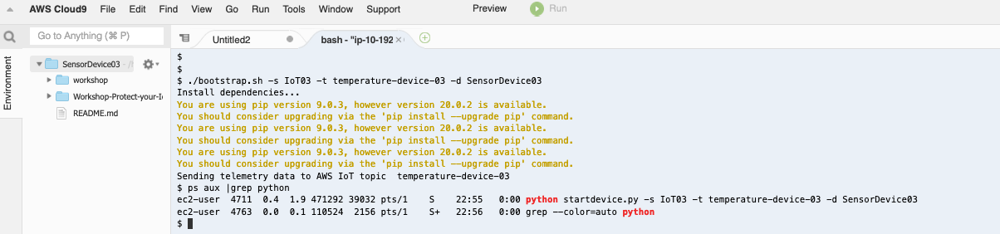
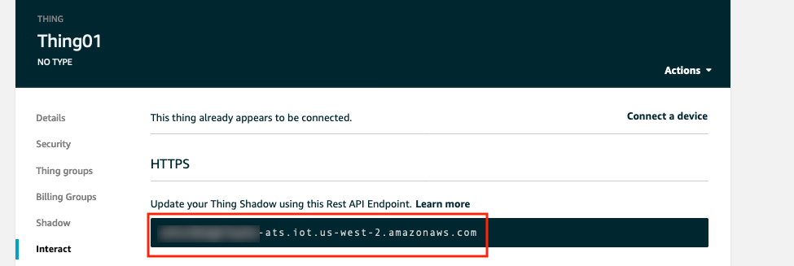
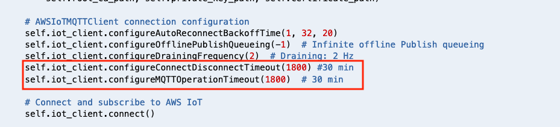
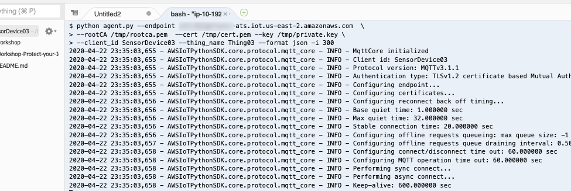
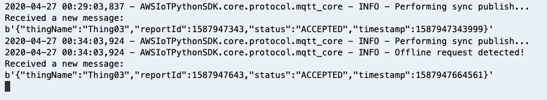

# Module 4: Detect a compromised device using device-side metrics 

In previous module, you used cloud-side metrics capture by AWS IoT to monitor and detect if a device has an abnormal behavior. You also built a solution to automatically isolate the device for quarantine. In this module you will learn how to monitor and stop suspicious device from any actions, by using metrics capture from the device itself. 

## 1. Configure SensorDevice03 to send telemetry data to AWS IoT

Device SensorDevice03 hasn't sent any temperature data to AWS IoT. In this step, you will need to start a bootstrap script on the device. This script will generate random temperature data and send it to AWS IoT endpoint.

* Open your Cloud9 environment. From Cloud9 environment terminal, go to directory below to run bootstrap script:
      
        cd /home/ec2-user/environment
        git clone https://github.com/hongpham/Workshop-Protect-your-IoT-fleet.git
        cd Workshop-Protect-your-IoT-fleet/
        cd 'Module 4: Detect a compromised device using device-side metrics'
        
**After repo is published, use CFN to download repo to Cloud9 during provisioning. Need to update git repo name after it's published. Also need to put a screen shot of these command.**

* Run script bootstrap.sh to install dependencies and make this device to send data to AWS IoT (make sure you are at directory 'Module 4: Detect a compromised device using device-side metrics'). In this workshop, the default topic name is **temperature-device-03**, default device name is **SensorDevice03**. See screenshot in step 4 for an example. 

        ./bootstrap.sh -t [topic name] -n [device name]
        
* The script will write AWS IoT Endpoint to a temporary file under /tmp/endpoint. You will need this endpoint later. 

*  This bootstrap script will start a python program in the background to send data to AWS IoT topic **temperature-device-03**. To validate if this device is sendind telemetry data, you can check if the script is running by the command below.
        
         ps aux |grep python   #this command search for the current running processes that has 'python' in it's name
         
If you see a process like **'python startdevice.py -t [topic name] -d [device name]**, this device is sending telemetry data to AWS IoT.
 

  
## 2. Install AWS Device Defender Agent to collect metrics on the device

In this step, you will install [AWS Device Defender Agent (Python version)](https://github.com/aws-samples/aws-iot-device-defender-agent-sdk-python) on this device **SensorDevice03**

*  Run these commands to install Agent

         cd /home/ec2-user/environment/workshop
         sudo pip install -r requirements.txt 
         sudo pip install AWSIoTDeviceDefenderAgentSDK
         
*  Open a text editor, retrieve neccesary parameters below and save it in your text editor. You will need these parameters to start Device Defender Agent

      a. AWS IoT Endpoint: when you run bootstrap.sh script to bootstrap the device, the script retrieve AWS IoT endpoint and save it under /tmp/endpoint. In the terminal, you can run the command  below to retrieve the endpoint:
       
          cat /tmp/endpoint
          
 
   **<details><summary>Click here if you can't find AWS IoT endpoint in /tmp/endpoint</summary><br>**
  
     1. If you don't have AWS IoT Endpoint in file /tmp/endpoint, you can retrieve it manually from AWS IoT Console.

     2. Go to **AWS IoT Core console**. Make sure that you are in the correct region. Click **Manage** to view list of IoT things. Click on any thing, for example **Thing01**. Click **Interact**. Copy the Rest API endpoint under **HTTPS**
    
        

   </details>
   
   
    b. Device name: in this workshop, default device name is  **SensorDevice03**
    
    c. Thing name: in this workshop, default thing name is **Thing03**

*  Extend Agent Connection timeout: the minimum interval to send device metrics to Device Defender is 5 minutes (300 s). In this workshop, to make sure the established connection between device and AWS IoT will not be closed when the Agent is collecting data, you will need to increase ConnectionTimeout
      
      a. Make sure you are in directory AWSIoTDeviceDefenderAgentSDK. Change timeout configuration by editing agent.py 
      
        cd /home/ec2-user/environment/workshop/AWSIoTDeviceDefenderAgentSDK
        vi agent.py
        
      b. Change the values of **configureConnectDisconnectTimeout** and **configureMQTTOperationTimeout** to **1800** seconds (30 minutes) 
      
      

      c. Save and close agent.py by pressing **Esc** on the keyboard, then type **:wq**
      
*  Start Device Defender Agent by running this command
        
        python agent.py --endpoint [your AWS IoT endpoint retrieved from step 2.a above]  \
        --rootCA /tmp/rootca.pem  --cert /tmp/cert.pem --key /tmp/private.key \
        --client_id [Device name] --thing_name [Thing name] --format json -i 300 > agent.out 2>&1




If you notice, you will see that X.509 certificate and it's private key is requried to start Device Defender Agent. These are credentials the Agent will use to send to AWS IoT. These credentials are already download for you under /tmp directory.

The Agent will collect metrics and sends to AWS IoT as json format every 300 seconds (or 5 minutes - which is minimum reporting interval)

*  After a few minutes, you should see a message confirm that Agent is sending metrics data to AWS IoT




Let the Agent run for a 10-15 minutes. Move to next step to configure device behaviors on Device Defender.

## 3. Define unusual behaviors

Your task is to implement a solution to detect unusual behaviors on the IoT device itself. Like in Module 3, you need to define when the value of each metric is considered outside of regularity.

You need to create a new **Security Profile**. In this case, you will create a Security Profile to allow Device Defender to monitor the bytes sent from the device. Device Defender can use [statisticalThreshold](https://docs.aws.amazon.com/iot/latest/developerguide/device-defender-detect.html#detect-behaviors) to detect if outgoing messages from your device are larger then the average number of bytes sent. 

*  Go to the IoT console.

*  On the left side of IoT Console, Click **Defend, Detect, Security Profiles**. Click the **Create** button on the upper right hand corner. 
 
*  Name this security profile as **DetectSendingMoreThanAverageBytes**.

*  Under **Behaviors**, create a behavior named **MoreBytesSent**. We ask Device Defender to observe the number of bytes and alert us it transmits sends a message that's more than 200 bytes. 

*  Click on drop down list under **Metric**, and choose metric **Bytes out**. Choose **Check Type** as **Absolute value** to check the exact number of bytes sent.

*  For **Operator**, choose **Greater than**. Specify **200** for **Vale**. That means if the number of bytes in a message sent from the device is more than 200 bytes, it will trigger an alert.

*  Choose **5 minutes** for **Duration** and leave the default **1** for both **Datapoints to alarm** and **Datapoints to clear**.

*  Expand the **Additional Metrics to retain** and check the box next to **Bytes out**. Click **Next**.

*  On the next page, send messages to the same SNS topic from Module 3 - **BadIoTDevices-<CFNStackName>** and select the role that starts with **<CFNStackName>-SNSTopicRole-** to grant permission for Device Defender to publish on the SNS topic. Click **Next**.

*  Check the box next to **All things** too attach the security profile to all IoT things. Click **Next**.

*  Review that the configuration is as detailed above and click **Save**, then **Continue**.


## 4. Respond to violations

Once your message violates the security profile, it will trigger a message to be sent to the SNS topic.
The SNS topic will trigger the same lambda function as Module 3. As before, when this lambda function is triggered, it will move the IoT Thing that represents your Cloud9 instance, to the isolated thing group.

## 5. Simulate a compromised device

In this section, we will be simulating a device that has been compromised and sending more data than it is supposed to send. 

### 5.1 Update message size

*  To update the number of bytes the Cloud9 instance will send to AWS IoT, go to the Cloud9 service page, under **Your environments**, click  **Open IDE** in the environment named **SensorDevice03**. 

*  From Cloud9 environment terminal, go to directory below to run bootstrap script:
      
        cd /home/ec2-user/environment
        git clone https://github.com/hongpham/Workshop-Protect-your-IoT-fleet.git
        cd Workshop-Protect-your-IoT-fleet/
        cd 'Module 4: Detect a compromised device using device-side metrics'
        
**After repo is published, use CFN to download repo to Cloud9 during provisioning. Need to update git repo name after it's published. Also need to put a screen shot of these command.**

*  Open the `startdevice.py` file:
```
vim startdevice.py
```

*  Go to line 86 and comment out the current telementrydata that generate random temperature telemetry data so line 86 looks like the following:

```
	#telemetrydata = round(random.uniform(15.1,29.9),2)
```

*  Instead, create a large random string has 3000 characters. To do so, uncomment the line of code below (line 89)

```
	telemetrydata = ''.join(random.choices(string.ascii_uppercase + string.digits, k = 3000)) 
```
*  Save this code change and re-run the bootstrap script:
```
./bootstrap.sh -t [topic name] -n [device name]
```

*  The device is now sending more bytes out than it should be. After 5 minutes, the device should show up in the **IsolatedDevices**.

Congrationlations! You have successfully used Device Defender Agent to monitor device behaviors from the device itself. If you have time to work on extra-credit challenges, move on to [Module 5: Send security alerts to your favourite messaging platform](../Module%205:%20Send%20security%20alerts%20to%20your%20favourite%20messaging%20platform/README.md)
