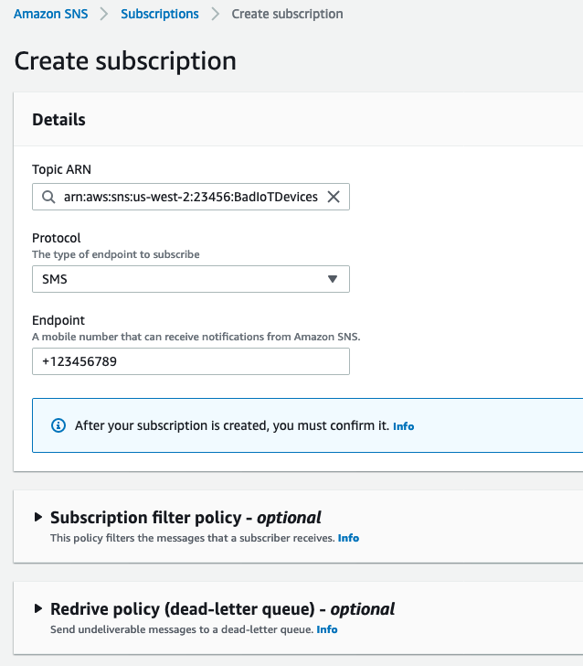
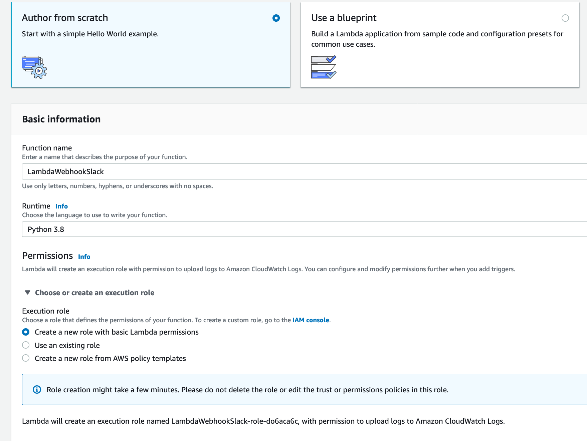
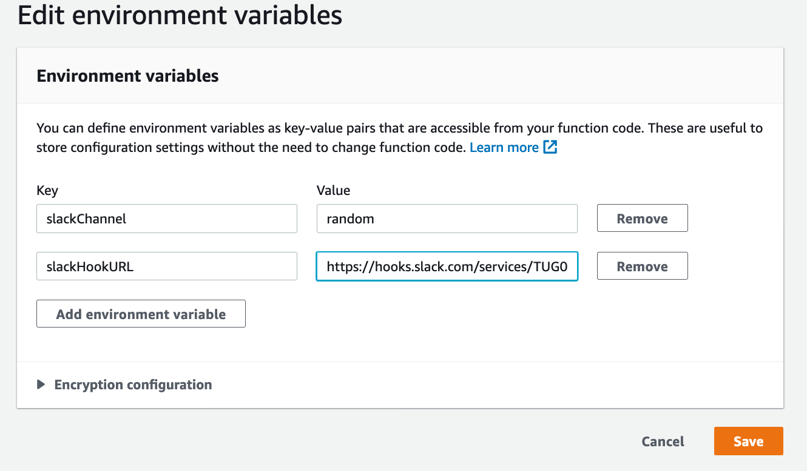

# Module 5: Send security alerts to your favourite messaging platform

For many Security Engineers, receiving alerts in real time is critical. They need to act quickly to reduce impact of security issues. SMS message, or messaging platform such as Slack or Chime, are common tools to notify engineers when thing goes wrong.

In this extra-credit module, you configure SNS to send Device Defender alerts to your phone, Amazon Chime chatroom, or Slack channel.

> Note: you need to have a SNS topic receives alerts from Device Defender to work on this module

1. [Send SMS message to your phone](#1-send-sms-message-to-your-phone-only-available-in-region-that-supports-sms-messaging)
2. [Receive alerts on Chime chatroom](#2-receive-alerts-on-chime-chatroom)
3. [Receive alerts on Slack channel](#3-receive-alerts-on-slack-channel)
4. [Test Alerts](#4-test-alerts)


## 1. Send SMS message to your phone (only available in [region that supports SMS messaging](https://docs.aws.amazon.com/sns/latest/dg/sns-supported-regions-countries.html)):

You can subcribe your phone number to SNS topic receive alerts from IoT Device Defender. When a new alert occurs, SNS will send you a SMS message (SMS cost will be charged)

* Sign in to your AWS account. From AWS console home, click **SNS**

*  On the left hand side, click on menu bar to show the list of SNS features. Click **Subscriptions**

*  Choose SNS topic that you use to receive alerts from IoT Device Defender. Choose **SMS** as protocal. Type in your phone number in **EndPoint**. Click **Create subscription**



You will need to confirm your subscription in order to start receiving SMS message.

Now you can move to [Test Alerts](#4-test-alerts) to test out this new intergration

## 2. Receive alerts on Chime chatroom

Amazon Chime is a communication tool that lets you chat and place calls. Chime provide a feature call Incoming Webhook to allow applications post message to Chime chatroom. You can configure SNS to send a message to your Chime chatroom when Device Defender generates an alert.

### 2.1 Configure Chime Webhook

If you don't have a chat room, you can create a new one. From Chime App, click **Rooms, Create a chat room, Done**
Click on the gear icon top right of the chat room. Then click **Manage webhooks and bots**. 

Click **Add webhook** and give it a name. Your webhook will have a unique URL e.g. https://hooks.chime.aws/incomingwebhooks/<guid>?token=xxxxxxxxxxxxxxxxxxxx). You need to protect this URL just as you protect any secret materials (API keys, username-password,..) because anyone has this URL can post a message to your chat room. Copy this URL and save it in a touchpad. You will need this URL to config Lamdbda function in step 2.2

### 2.2 Create deployment package for Lambda function

Since SNS doesn't intergrate with Chime directly, we will use a Lambda function to post the SNS message to the Chime chatroom. You will need to create a deployment package for this Lambda function by following these steps:


   a. Clone this workshop github repo, change directory to 'Module 5: Send security alerts to your favourite messaging platform', navigate to folder 'LambdaWebhookChime'. This folder should only have a python script index.py at the moment.

   b. We will install neccessary dependecies for this python script. Under device folder, create a subfolder called Package. 
        
            mkdir Package
            cd Package

   c. Install these dependencies, choose Package as target folder. 
        
            pip install --target . requests

   d. Create a zip archive of the dependencies named webhookchime.zip in Package and store it in LambdaWebhookChime folder. Run this command when you currently in Package folder
   
      zip -r9 ../webhookchime.zip .

   e. Add python script device.py to the archive
      
      cd ..
      zip -g webhookchime.zip index.py
    
   f. You will upload this zip file when you create lambda function next step

### 2.3 Configure Lambda function

From Lambda management console, create a new Lambda function. Give this new function a name and choose Python3.* as runtime with default permissions. 

Now we already write the code for this lambda function and install all dependencies in previous step. Upload this deploymet packages webhookchime.zip to the Lambda function. Under **Function code**, click the drop down **Code entry type**, and choose **Upload a .zip file**. Make sure the function hander is 'index.handler'. Here is the code snippet of this Lambda function

```python
import json
import os
import boto3
import requests
from base64 import b64decode

def get_message(event):
  try:
    message = json.loads(event['Records'][0]['Sns']['Message']) 
    thing = 'Thing name: ' + message['thingName']
    securityprofile = 'Security profile: ' + message['securityProfileName']
    behaviorname = 'Behavior name: ' + message['behavior']['name']
    return " | ".join([thing,securityprofile,behaviorname])
  except KeyError:
    return 'test message'

def handler(event, context):
  print('Getting ready to send message to Amazon Chime room')
  content = 'IoT Device Defender alert! {0}'.format(get_message(event))
  webhook_uri = os.environ['CHIME_WEBHOOK']
  requests.post(url=webhook_uri, json={ 'Content': content })
  print('Finished sending notification to Amazon Chime room')

```

Next create an environment variables to provide Chime Webhook URL to Lamdba function. Scroll to **Environment Variables**. From the right side, click **Edit --> Add environment variables**. Add **CHIME_WEBHOOK** as the Key and provide webhook URL as the Value. Click Save

This function parse the SNS message to retrieve Thing name, Security Profile, and Behavior name, then it use *requests* method to post these information to the webhook URL. In this lab, we have stored the webhook URL as an environment variable **CHIME_WEBHOOK**. In production use cases, we would recommend to store it securely using AWS Secrets Manager or any existing tools/vault that your team is using.

When you have succcesfully created this Lambda function, let's add SNS as a trigger. Under **Designer**, click **Add trigger** and select **SNS**. Choose the SNS topic that you configured to receive IoT Device Defender alerts in. Remember to check box **Enable trigger**. Then click **Add**

Now you can move to [Test Alerts](#4-test-alerts) to test out this new intergration

## 3. Receive alerts on Slack channel

You need to have  a Slack channel in this session. To configure Device Defender send alerts to Slack channel, follow steps below

### 3.1 Create a Slack Incoming WebHook

Start by setting up an [incoming webhook integration](https://my.slack.com/services/new/incoming-webhook/). Choose the channel that Webhook will post messages to and click **Add Incoming Webhooks integration**

Note down the **Webhook URL** and save it in your favourite text editor.

### 3.2 Create Lambda function to post messages to Slack

Sign in to your AWS account. Go to Lambda console and create a Lambda function to post the message to the channel. 

Click **Create function**. Select **Author from Scratch**.





Name this lambda function. Chose **Python 3.8** for Runtime, and choose **Create a new role with basic Lambda permissions** for Execution Role. Click **Create function**

Replace the code in Lambda function with Python code below. You can also download it from [LambdaWebhookSlack.py](/
LambdaWebhookSlack.py). Remember to click Save


```python

import boto3
import json
import logging
import os

from base64 import b64decode
from urllib.request import Request, urlopen
from urllib.error import URLError, HTTPError

#The hook URL of Slcak channel
HOOK_URL = os.environ['slackHookURL']
# The Slack channel to send a message to stored in the slackChannel environment variable
SLACK_CHANNEL = os.environ['slackChannel']


logger = logging.getLogger()
logger.setLevel(logging.INFO)


def lambda_handler(event, context):
    logger.info("Event: " + str(event))
    message = json.loads(event['Records'][0]['Sns']['Message'])
    logger.info("Message: " + str(message))
    
    thing = 'Thing name: ' + message['thingName']
    securityprofile = 'Security profile: ' + message['securityProfileName']
    behaviorname = 'Behavior name: ' + message['behavior']['name']

    slack_message = {
        'channel': SLACK_CHANNEL,
        'text': " You have a new Device Defender alert:  %s, %s, %s" % (thing, securityprofile, behaviorname)
    }

    req = Request(HOOK_URL, json.dumps(slack_message).encode('utf-8'))
    try:
        response = urlopen(req)
        response.read()
        logger.info("Message posted to %s", slack_message['channel'])
    except HTTPError as e:
        logger.error("Request failed: %d %s", e.code, e.reason)
    except URLError as e:
        logger.error("Server connection failed: %s", e.reason)
```


Under **Environment variables**, click **Edit** and **Add environment variable**. You need to add two environmen variables **slackHookURL** and **slackChannel**. Provide values for these variables. Then click **Save**




Now add SNS as a trigger for this function. Under **SNS trigger**, choose the SNS topic that Device Defender sends alerts to. From previous modules, a SNS topic **BadIoTDevices-[CloudFormation stackname]** was created. You can use this SNS topic or create a new one. Remember to check box **Enable trigger**. Then click **Add**

> Note: we recommend to protect your WebHookURL just like you pretect a password. You can use KMS to encrypt the URL of the webhook, and base-64 encode it before pasting it in to the code. An example can be found in [Slack Integration Blueprint for Lambda](https://aws.amazon.com/blogs/aws/new-slack-integration-blueprints-for-aws-lambda/)

Now you can move to [Test Alerts](#4-test-alerts) to test out this new intergration

## 4. Test alerts

To test if notification works, you can publish this test SNS message below using SNS console. This is an example alerts generated by Device Defender.

*  Sign in to your AWS account, click **SNS** to go to SNS console

*   On the left side, click on menu bar, and click **Topics** to see the list of SNS topics. In this module, select **BadIoTDevices-[CloudFormation stackname]** topic.

*  Click **Publish message** on the top right corner. Copy the json blob below to **Message body to send to the endpoint**. Then click **Publish message**

```json
{
  "violationEventTime": 1582745400000,
  "thingName": "myIoTDevice",
  "behavior": {
    "criteria": {
      "consecutiveDatapointsToClear": 1,
      "value": {
        "count": 5000
      },
      "consecutiveDatapointsToAlarm": 1,
      "comparisonOperator": "greater-than"
    },
    "name": "messageSize",
    "metric": "aws:message-byte-size"
  },
  "violationEventType": "in-alarm",
  "metricValue": {
    "count": 26
  },
  "violationId": "123456789",
  "securityProfileName": "LargeMessageSize"
}
```

Congratulations! You have succesfully sent Device Defender alerts in real time to your favourite communication tools. 
